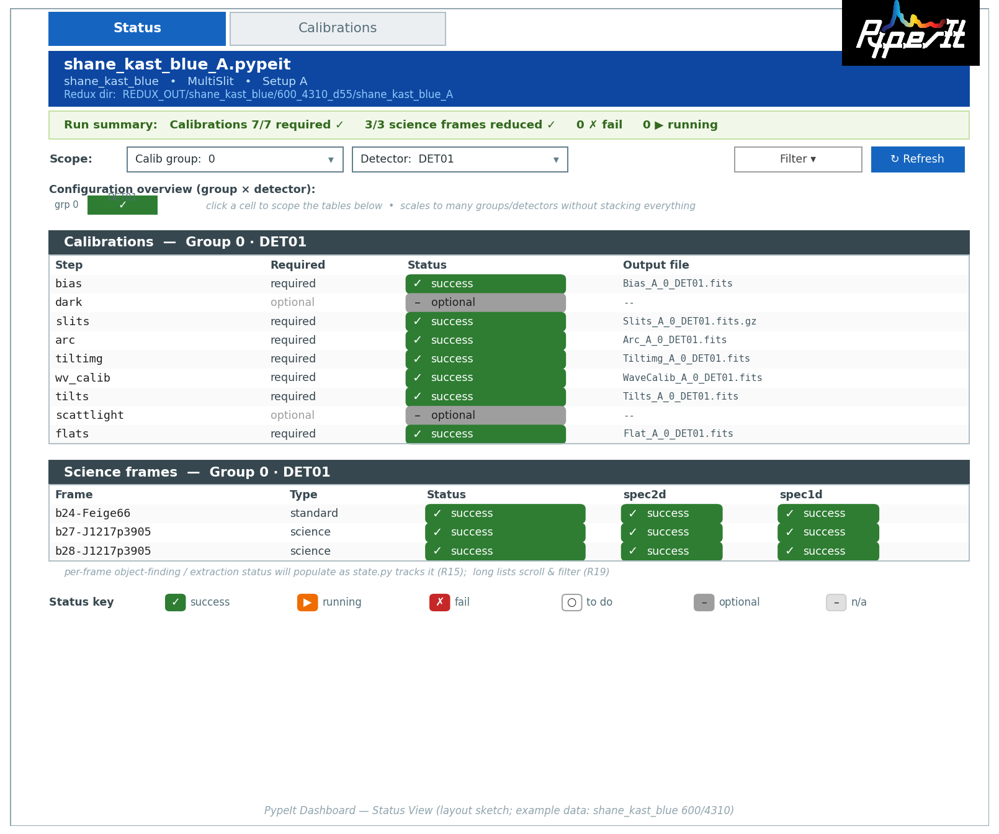
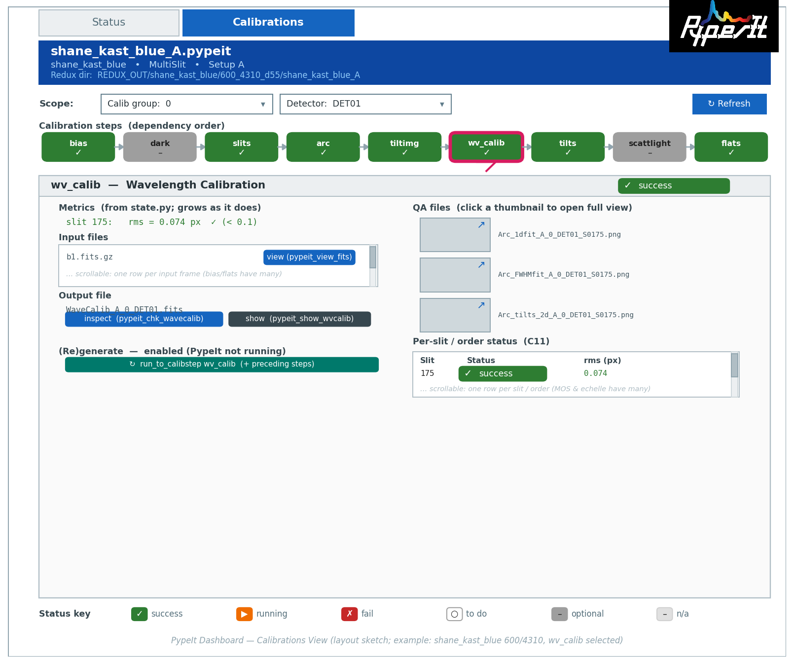

# PypeIt Dashboard — Design Document

**Version:** 1.1.0
**Date:** 2026-06-14
**Author:** JXP and Claude

**Changelog**
- 1.1.0 (2026-06-14): **Stage 4 implemented — Execution, Locking & (Re)Build.**
  Marked C10/C15 and X1–X3 **Implemented (Stage 4)**: the detail panel's
  **(Re)Build** control (blue action button, labeled "(Re)Build" per the user)
  launches `pypeit_run_to_calibstep`; a `RunLock` enforces the single-run lock
  (Dashboard-launched **or** detected via the reduction `.log` mtime); a
  `QMessageBox` clobber confirmation names the file(s) overwritten; clobber is
  "delete-then-run" in code (option (a), no pipeline `--clobber`); the state
  refreshes on completion. Updated C10 and the detail-panel bullet for the
  "(Re)Build" name + blue action color.
- 1.0.1 (2026-06-14): **Stage 4 consistency pass.** Reconciled the doc with the
  Stage 3 code: per-type "Inspect output" viewers now read
  `pypeit_view_fits --inter` for processed images (was `ginga`), `wv_calib` is
  *no separate viewer* (QA only), `flats` is `pypeit_chk_flats`, and input files
  are viewed via `pypeit_view_fits --proc` (detail-panel bullets and C7/C8
  updated to match). Re-bucketed the Calibrations and Execution **Requirements**
  into Specification + Status: marked C1–C9/C11–C14/C16 and X4/X5 **Implemented
  (Stage 3)**, leaving C10/C15 and X1–X3 **Pending (Stage 4)**.
- 1.0.0 (2026-06-14): First **versioned release** of the Dashboard docs
  (semantic versioning starts here). Coincides with Stages 0–3 implemented and
  the user-facing docs (`doc/dashboard/dashboard.rst`, `doc/state.rst`).
- 0.12 (2026-06-14): Updated the **Flats** references for the reworked
  `FlatsState` (`claude_prompts/state.md`): metric `types` → **`corrections`**
  (+ `pixelflat_source`, grouped input files) and **per-slit** status (incl.
  `skip`) + per-correction `mean`/`rms`; **added `flats` to the C11 per-slit
  drill-down** (state-metrics list, Calibrations detail panel, per-type table,
  and C11).
- 0.11 (2026-06-13): **Scheduled the Dashboard status/activity area (X4/X5) for
  Stage 3** (was Stage 4), per Stage 2 sign-off feedback — so the GUI shows a
  visible "busy / waiting on a job" indicator and clarifies what Refresh did
  (re-loaded vs. re-derived the state) as early as the Calibrations view.
- 0.10 (2026-06-13): Clarified **launch mechanism** (Initialization → How launch
  works, and R1): the dashboard launches **like every other PypeIt script** via
  the `pypeit_dashboard` console script (a `ScriptBase` entry point, as
  `run_pypeit`), with the `.pypeit` file as a **required positional** argument.
- 0.1 (2026-06-12): Preamble; first draft of the Initialization section.
- 0.2 (2026-06-12): Revised Initialization to reflect the user's answers in
  Clarifications — science-frame status is forthcoming (design accommodates it),
  metrics live in other windows (not the state table), the `.pypeit` file is a
  required launch argument, blocking the UI on launch is acceptable, and the
  refresh strategy depends on whether PypeIt is running.
- 0.3 (2026-06-12): Added the Calibrations section — the per-(calibration group,
  detector/mosaic) detail view, its color-coded step buttons (grounded in
  `default_steps()` ordering and `state.py` status), the detail panel, and the
  `pypeit_run_to_calibstep` launch path.
- 0.4 (2026-06-12): Revised Calibrations per the user's answers — **unified the
  Dashboard-wide status palette** (running = orange, required-undone = white;
  Initialization key updated to match), `bpm` omitted from the button row, the
  input/output viewers split (raw → `pypeit_view_fits`, processed → `ginga`),
  always launch with `--calib_group`/`--det`, and noted the metric set will grow
  as `state.py` does.
- 0.5 (2026-06-12): Embedded the Status View layout sketch and added the
  anti-clutter scoping design — calib-group/detector **scope drop-downs** (R16),
  a **configuration-overview navigator** grid (R17), and an equally-prominent,
  scalable **Science frames** section (R18).
- 0.6 (2026-06-12): Embedded the Calibrations View sketch; added the **PypeIt
  logo** to the shared header banner (R6); recorded the **magenta selected-step**
  highlight; and refined Calibrations requirements — QA entries are **clickable**
  to a full view (C9), input files and per-slit/order rows are **scrollable
  lists** (C7, C11), and the (re)generate control uses a distinct **action
  color** (C10).
- 0.7 (2026-06-12): Moved the logo to the **top-right corner** (it was clobbering
  the banner) and pointed image references at the new
  `pypeitdev/dashboard/images/` folder (downscaled `pypeit_logo.png` + the two
  sketch PNGs).
- 0.8 (2026-06-13): Added the **Execution, Locking & Status** section —
  single-run lock (X1), clobber confirmation + capability for (re)generation
  (X2/X3), and the Dashboard's own status/activity area (X4/X5); cross-linked
  from C10.
- 0.9 (2026-06-13): Resolved the two execution clarifications — detect an
  external run by **watching the `.log` mtime** (X1), and **clobber only the
  selected step** on regeneration (X3).

---

## Preamble

### What this document is

This is the design document for the **PypeIt Dashboard**: a desktop graphical
application that gives a PypeIt user a single, coherent place to launch, monitor,
and inspect a spectroscopic data reduction. It records the *requirements* and the
*design* of the dashboard — what it must do, how it should be organized, and how
its pieces fit together. It deliberately stays at the level of architecture,
views, and behavior; it does **not** prescribe specific code or APIs (those will
be worked out during development). It is a living document and will grow phase by
phase.

### What the dashboard is for

PypeIt is a powerful but verbose, command-line-driven pipeline. A typical
reduction involves editing a `.pypeit` file, launching a long-running
`run_pypeit` process that emits a torrent of log messages, and then inspecting a
scattered collection of calibration files, 2D/1D spectra, and fixed-format QA
figures using a family of separate `pypeit_chk_*` / `pypeit_show_*` scripts. The
state of a reduction — what has run, what succeeded, what to look at next — is
not surfaced in any one place.

The dashboard's job is to make that workflow **legible and navigable**: to show
at a glance where a reduction stands, what it has produced, where it may have
gone wrong, and to put the existing inspection tools one click away.

### Scope

Per the project goals, the dashboard concentrates on the **core run** of PypeIt —
**Phase 2 (Reduction)** and **Phase 3 (Inspection / QA)** of the workflow
described in `pypeit_workflow.md`. Concretely, it will at least:

- Display the **state** of a PypeIt reduction (a color-coded, formatted status
  view of frames / calibration groups / steps).
- Let the user **run individual steps** of the reduction.
- Let the user **examine standard PypeIt outputs** (calibrations, `spec2d`,
  `spec1d`, QA figures) easily.
- Let the user **launch existing PypeIt scripts** (e.g. `pypeit_chk_edges`,
  `pypeit_show_2dspec`) to inspect files.
- **Monitor the progress** of a running reduction.

**Out of scope (for now):** the Setup phase (frame typing / `.pypeit` file
generation — already served by an existing setup GUI) and the further-processing
phase (fluxing, 1D/2D/3D coaddition, telluric, collation).

### Relationship to other documents

- **`pypeit_workflow.md`** is the companion context document. It captures our
  working understanding of the PypeIt reduction workflow (phases, scripts,
  products, QA touch-points) and includes a concrete worked example
  (Shane Kast blue 600/4310). **All design decisions in this document should be
  grounded in, and cross-referenced to, that workflow.**
- The PypeIt source (`PypeIt/`) and its documentation are the ultimate
  authority on behavior; the dashboard should **reuse existing PypeIt code**
  (e.g. status/state logic, `DataContainer` IO, the `pypeit_chk_*` machinery)
  rather than reimplement it.

### Technology and conventions

- **Language:** Python.
- **GUI toolkit:** PyQt6.
- **Code location:** dashboard code lives in `pypeit/dashboard/`; design-phase
  scratch/prototype code lives in
  `PypeIt-development-suite/pypeitdev/dashboard/py/`.
- **Image assets:** design images — the layout-sketch PNGs and the (downscaled)
  PypeIt logo (`pypeit_logo.png`) — live in
  `PypeIt-development-suite/pypeitdev/dashboard/images/`.
- This document avoids specific code recommendations but assumes the Python +
  PyQt6 stack throughout.

### Design principles (proposed)

These are starting principles to guide the detailed design that follows; they
can be revised as the design matures.

1. **State-first.** The landing view answers "where is this reduction?" before
   anything else.
2. **Reuse, don't reinvent.** Wrap existing PypeIt scripts/logic; treat PypeIt
   as the source of truth for state and products.
3. **Workflow-faithful.** The dashboard's structure mirrors the real PypeIt
   workflow (Reduction → Inspection/QA) so users' mental model transfers.
4. **Path-aware.** MultiSlit / Echelle / IFU differ in products and QA; views
   should adapt to the spectrograph's reduction path.
5. **Non-destructive and observable.** Long-running actions report progress and
   never silently overwrite; the user always knows what the dashboard is doing.

### Document structure (planned)

This document will be built up section by section, following the project's
design phases:

- **Preamble** (this section).
- **Initialization** — how the dashboard launches and what it shows on startup.
- **Calibrations** — the per-(group, detector) calibration detail/inspect view.
- **Execution, Locking & Status** — cross-cutting run control (single-run lock,
  clobber protection, the Dashboard's own status/activity area).
- *(subsequent phases: science-frame reduction, Inspection/QA, Monitoring, ...
  — to be added.)*

---

## Initialization

This section sets the requirements and design for the **Initialization phase** —
how the dashboard is launched and what it presents to the user on startup. The
goal of startup is to answer, immediately and unambiguously, the question
*"where does this reduction stand?"* (design principle #1, *state-first*).

### How launch works

- The dashboard is started **like every other PypeIt command-line script**
  (e.g. `run_pypeit`): via the **`pypeit_dashboard`** console script — a
  `ScriptBase` subclass (`RunDashboard`) registered as a `pyproject.toml` entry
  point, exactly as `run_pypeit` is. It is run from within a reduction folder —
  i.e. the per-configuration directory created by `pypeit_setup`
  (e.g. `shane_kast_blue_A/`) that contains the `.pypeit` file. (A
  `python -m pypeit.dashboard` convenience may also be provided, but the console
  script is the primary launch path.)
- The user provides the name of the `.pypeit` file to use as a **required
  positional launch argument**. The dashboard does not guess, so the presence of
  more than one `.pypeit` file in the folder is not a problem.
- On startup the dashboard derives the reduction **state**, then renders it as
  the default view: a color-coded, formatted **State Table**. Deriving the state
  may briefly block the UI on launch, which is acceptable (see below).

### State: where it comes from

Grounded in `PypeIt/pypeit/state.py` and `pypeit/scripts/pypeit_status.py`
(see also the worked example in `pypeit_workflow.md` §6):

- The state is modeled by the pydantic class `RunPypeItState`. It records, per
  **calibration group** (`calib_id`) and **detector / mosaic** (`det`), the
  status of each calibration **step**. The steps currently tracked are: `bias`, `dark`,
  `arc`, `tiltimg`, `slits`, `wv_calib`, `tilts`, `scattlight`, `flats`,
  `align`.
- Each step entry carries: a `required` flag, `input_files`, an `output_file`,
  optional `qa_files`, a `status` ∈ {`undone`, `running`, `success`,
  `complete`, `fail`}, and **step-specific metrics**:
  - `bias`: `mean`, `std`
  - `slits`: `nslits`, and per-slit `center`
  - `wv_calib`: per-slit `rms`
  - `tilts`: per-slit `rms`
  - `flats`: `corrections` (which of `pixelflat`/`spat_illum`/`spec_illum` were
    applied), `pixelflat_source`, grouped input files, **and per-slit** status
    (incl. `skip`) + per-correction `mean`/`rms` (reworked 2026-06-14; see
    `claude_prompts/state.md`)

  **Design decision:** these metrics are valuable but are **not** shown in the
  state table. They are surfaced in the Dashboard's dedicated inspection windows
  (Inspection phase). The state table reports only the *status* of each step —
  keeping it a clean, scannable health overview rather than a metrics dump.
- Two sources of state, in priority order:
  1. **State file present** — load `<pypeit_root>_state.json` directly via
     `RunPypeItState.load()`. This is fast and is what a finished or in-progress
     `run_pypeit` leaves behind (confirmed in §6 of the workflow doc).
  2. **No state file** — compute the state the way `pypeit_status.py` does:
     instantiate `PypeIt(..., calib_only=True)` and call
     `calib_all(status_only=True, reload_only=True)`, then read
     `pypeIt.run_state`. No processing is performed. Because the user names the
     `.pypeit` file explicitly, there is no file ambiguity to resolve. This
     computation can take a moment for large multi-slit reductions; it is
     acceptable for it to briefly **block the UI on launch** (no background
     thread is required for initialization).
- **Refresh strategy** (see R12): once running, prefer whichever source is
  authoritative *at that moment* — if a `run_pypeit` reduction is **active**,
  re-read `*_state.json` (the running process owns and updates it); if **no**
  reduction is running, re-derive the state via the `pypeit_status` path above.
- A convenient tabular reduction of the state already exists
  (`RunPypeItState.get_status()` → a pandas DataFrame with columns
  `calibration_group`, `detector`, `steps`, `required`, `status`,
  `output_file`); the dashboard should build on this rather than re-deriving it.

**Important — science-frame status is coming.** Today the state model tracks
**calibration steps only**; it does not yet capture per-science-frame object
finding / extraction status. This is, however, planned: `RunPypeItState` *will*
be extended to record science-frame status. The Initialization design must
therefore **anticipate** science frames from the start — the state view should
extend naturally to a *science* section presented alongside the *calibration*
section (see R8 and R15), rather than being hard-wired to calibrations only.

### Requirements

Requirements are tracked in three buckets so the document doubles as a checklist
as development proceeds.

#### Pending

- **R14. Live status updates (planned).** While a reduction is running, the
  state view should reflect progress in (near) real time. This is planned but
  its **implementation/channel is open** — the commented-out `log.step`
  "broadcast" hook in `state.py` is one candidate (a log-stream channel),
  polling `*_state.json` is another. The detailed design is deferred to the
  **Monitoring** phase; Initialization only needs to not preclude it.
- **R15. Science-frame readiness.** The state view must be designed so that, once
  `RunPypeItState` is extended to track per-science-frame status (object finding
  / extraction), it can be shown as a *science* section alongside the
  *calibration* section — reusing the same status encoding (R10), grouping (R8),
  and summary (R7) — without a redesign.
- **R18. Equally-prominent, scalable Science section.** The Science-frames
  section is given **equal visual weight** to the Calibrations section (same
  heading treatment). For runs with many science frames it is **filterable and
  scrollable** with a visible frame count, so long lists do not overwhelm the
  view. Columns include the per-frame products (`spec2d`, `spec1d`) and will gain
  object-find/extraction status as the state model grows (R15).

#### Implemented

*(Implemented and verified in **Stages 0–2** — see
`claude_prompts/dashboard/dashboard_dev_stages_0-1.md` and
`dashboard_dev_stage_2.md`. R15/R18 Science section is scaffolded as a
placeholder; its population is deferred to the science-frames stage.)*

- **R1.** The dashboard launches **like every other PypeIt command-line script**
  (e.g. `run_pypeit`): via the `pypeit_dashboard` console script, a `ScriptBase`
  subclass (`RunDashboard`) registered as a `pyproject.toml` entry point.
  Implemented in `pypeit/scripts/pypeit_dashboard.py` (+ optional
  `python -m pypeit.dashboard`).
- **R2.** Launched from a folder containing a `.pypeit` file, with the `.pypeit`
  file given as a **required positional** argument (so multiple `.pypeit` files
  are unambiguous). A missing argument is a clean argparse error.
- **R6. Context header.** A header banner shows the `.pypeit` file name, the
  spectrograph (`PYP_SPEC`), the setup/configuration ID, the **Pipeline**
  (MultiSlit / Echelle / IFU; field labeled "Pipeline" per user feedback), and
  the reduction directory, with the **PypeIt logo** in the **top-right corner**.
  Built as `pypeit/dashboard/view/header.py`, shared above the
  Status/Calibrations tabs in the `MainWindow`. The long filename/path values
  use an eliding label so the window can be resized narrower. (Stage 0 fills it
  from cheap `.pypeit` metadata via `read_header_info`, not the state.)
- **R4 / R5 (Stage 1).** The headless `pypeit/dashboard/model.py`
  `DashboardModel` acquires the reduction state by **source priority**: load
  `<root>_state.json` via `RunPypeItState.model_validate` when present (R4),
  else **derive** it via
  `PypeIt(reuse_calibs=True, calib_only=True).calib_all(status_only=True,
  reload_only=True)` → `run_state` (R5). It exposes a **normalized** status
  table (real `bool` `required`, an `in_pipeline` column, `absent`/`None`
  sentinels), the `(calib_id, det)` enumeration, and the path-aware
  `step_order()` (from the spectrograph's `default_steps()`, `bpm` omitted).
- **R11 (Stage 1).** Graceful edge states are reported via
  `DashboardModel.load_status` without raising: `file_not_found`,
  `not_started` (no/empty state), `malformed` (unreadable or
  schema-mismatched state file), and `error` (derive failed). Covered by
  committed `pypeit/tests/files/dashboard_state_*.json` fixtures + headless
  tests.
- **R3, R7–R10, R12, R13, R16, R17 (Stage 2).** The Status view
  (`pypeit/dashboard/view/status_view.py`) renders the model as the
  state-first landing view: the color-coded, scoped state **table** (Step |
  Required | Status | Output) in pipeline order (R3, R8) with color **+ glyph
  + label** from the palette (R10) and dimmed optional rows (R9); the
  always-visible **summary strip** (R7); the **scope drop-downs** (R16,
  group + detector, det names via the spectrograph); the
  **configuration-overview navigator** grid colored by worst status with
  click-to-scope (R17); a **Refresh** that re-acquires the model (R12,
  manual); and a non-blocking **stale** badge via `DashboardModel.is_stale()`
  (R13). Theme-aware (light/dark). Verified by `pytest-qt` structural tests +
  the layout-check render matrix. *(R12's active-run-aware source selection
  and R14 live updates remain for Stage 4/5.)*

#### Deferred

- **D1.** Editing the `.pypeit` file from within the dashboard — Setup-phase
  concern, out of scope (an existing setup GUI covers it).
- **D2.** Multi-configuration / multi-setup overview (several `.pypeit` runs side
  by side) — possible future top-level view.

### Default State View — visual design

Readability and clarity are the priorities (per the brief). Proposed treatment:

The layout sketch below (generated by
`pypeitdev/dashboard/py/dashboard_status_view.py`, example data:
`shane_kast_blue` 600/4310) illustrates the target:

- **Layout.** Top to bottom: tab bar (Status | Calibrations) → header banner
  (R6) → global summary strip (R7) → **scope toolbar** with the calib-group and
  detector drop-downs + filter/refresh (R16) → **configuration-overview
  navigator** grid (R17) → the **Calibrations** section (steps for the selected
  scope) → an equally-prominent **Science frames** section (R18). The two
  sections share the same heading treatment, and the Science section is present
  from the start (populating as the state model grows, R15).
- **Columns.** `Step` | `Required` | `Status` | `Output`. Step names bold; file
  names in a monospace font. Per-step metrics and per-slit detail are
  intentionally **not** columns here — they live in the inspection windows.
- **Status color key** (color + glyph, R10). This is the **Dashboard-wide status
  palette**, reused verbatim by the Calibrations view:

  | Status                  | Color (proposed)            | Glyph |
  |-------------------------|-----------------------------|-------|
  | success / complete      | green (#2E7D32)             | ✓ |
  | running                 | orange (#EF6C00), subtle pulse | ⏳ |
  | fail                    | red (#C62828)               | ✗ |
  | required & not done     | white (#FFFFFF, outlined)   | ○ |
  | optional / not required | grey (#9E9E9E)              | – |
  | not used / n/a          | dimmed light grey (#BDBDBD) | – |

  White needs a subtle border to read on a light background. A dark-theme-aware
  palette should keep equivalent contrast ratios.
- **Scanning aids.** Sticky group/column headers, gentle zebra striping, and a
  filter control (e.g. *required only*, *failures only*) to cut visual load on
  large MOS/echelle reductions.
- **Empty/edge states (R11).** Render as a clear centered message with the next
  action (e.g. *"No reduction outputs found — this reduction has not been run.
  [Run reduction]"*), rather than an empty grid.

### Resolved decisions and remaining open items

The questions raised during the first draft were answered by the user in the
`#### Clarifications` section of the parent `dashboard_design.md`. Resolutions
now folded into this section:

- **Science-frame status** — coming; the design accommodates it (R8, R15).
- **State computation cost** — blocking the UI on launch is acceptable (R5).
- **Which `.pypeit` file** — supplied explicitly by the user at launch (R2).
- **Refresh source** — depends on whether a reduction is running (R12).
- **Metrics** — shown in other (inspection) windows, not the state table.

Remaining open item, carried to a later phase:

- **Live-update channel (R14).** Whether live monitoring rides the `log.step`
  broadcast hook, `*_state.json` polling, or another mechanism is open and will
  be settled in the **Monitoring** phase.

---

## Calibrations

The **Initialization** state table (above) is the at-a-glance overview. The
**Calibrations** view is the drill-down: a separate tab that shows the *detailed*
status of the calibrations for **one** calibration group and **one**
detector / mosaic at a time, and that lets the user inspect each calibration and
(re)generate it. It is where a user answers "is this calibration good, and if
not, what do I do about it?" and allows them to remake it.

This section first lays out the view and the backend it drives, then gives
per-calibration-type specifics, then the formal requirements.

The layout sketch below (generated by
`pypeitdev/dashboard/py/dashboard_calibrations.py`, example data:
`shane_kast_blue` 600/4310 with `wv_calib` selected) illustrates the target:

### Selecting the context

- The view operates on a single `(calibration group, detector/mosaic)` pair,
  chosen by the user via two **drop-down lists** populated from the state
  (`RunPypeItState` enumerates the `(calib_id, det)` pairs; see Initialization).
- Changing either drop-down re-renders the step buttons and clears/refreshes the
  detail panel for the new context.

### The calibration step buttons

The heart of the view is a row of **clickable step buttons**, one per
calibration step, laid out **left → right in dependency order** so the visual
order matches the order in which PypeIt builds them (and the order in which
`pypeit_run_to_calibstep` would generate them). Connectors/arrows between
buttons reinforce "this step precedes that one".

**Path-awareness (which steps, in which order).** The set and order of steps come
from the spectrograph's pipeline, i.e. `Calibrations.default_steps()`:

- **MultiSlit / Echelle:**
  `bias → dark → bpm → slits → arc → tiltimg → wv_calib → tilts → scattlight →
  flats`
- **IFU:**
  `bias → dark → bpm → arc → tiltimg → slits → wv_calib → tilts → align →
  scattlight → flats`

IFU adds an `align` step and orders `slits` after `arc`/`tiltimg`; the button row
must reflect the active spectrograph's pipeline rather than a fixed list.

**`bpm` is not shown.** The bad-pixel-mask step runs internally as part of the
pipeline but produces no standalone output file or QA (its `step_frame_map` entry
is `None`); per the design decision it is **omitted from the button row** (it is
still executed by `pypeit_run_to_calibstep` as a preceding step when needed).

**Button color coding.** Each button's color encodes the step's state, derived
from the `(required, status)` fields in `state.py` together with whether the step
is part of the spectrograph's `default_steps()`. This uses the **Dashboard-wide
status palette** defined in Initialization (the two views are now unified):

| Condition                            | State source                         | Color (glyph) |
|--------------------------------------|--------------------------------------|---------------|
| Step not used by this spectrograph   | step ∉ `default_steps()`             | dimmed light grey #BDBDBD (–), disabled |
| Not required                         | `required = False`                   | grey #9E9E9E (–) |
| Required but not yet generated       | `required = True`, `status = undone` | white #FFFFFF, outlined (○) |
| Currently being generated            | `status = running`                   | orange #EF6C00, subtle pulse (⏳) |
| Generated successfully               | `status ∈ {success, complete}`       | green #2E7D32 (✓) |
| Failed to generate                   | `status = fail`                      | red #C62828 (✗) |

As in the state table (R10), color is **paired with a glyph/label** so status
never depends on color alone.

**Selected step.** The currently selected step (whose detail panel is shown) is
indicated with a thick, high-contrast **magenta ring** (`#D81B60`) plus a
pointer toward the detail panel — chosen because it reads clearly against the
green/grey/white/orange status fills (a blue ring was hard to see).

### The detail panel (on selecting a step)

Clicking a step button selects it and opens a **detail panel** for that step. Per
the user's vision, the panel provides:

- **Metrics.** The step's quality metrics (this is one of the "other windows"
  where metrics belong, per the Initialization decision). From `state.py` today:
  `bias` → `mean`, `std`; `slits` → `nslits` + per-slit `center`; `wv_calib` →
  per-slit `rms`; `tilts` → per-slit `rms`; `flats` → `corrections` +
  `pixelflat_source` + per-slit per-correction `mean`/`rms` (reworked
  2026-06-14). The panel surfaces
  whatever metrics the state exposes, so this set will **grow as `state.py`
  gains metrics**. Metrics may be threshold-colored using the workflow doc's
  rules of thumb (e.g. wavelength / tilt `rms` < 0.1 px = good).
- **Inspect the output.** A control to launch the appropriate viewer for that
  calibration's processed output file (see the per-type table below): a dedicated
  `pypeit_chk_*` script where one exists (e.g. `slits` → `pypeit_chk_edges`,
  `tilts`, `flats`), otherwise **`pypeit_view_fits --inter`** to render the
  intermediate processed image (`bias`, `dark`, `arc`, `tiltimg`). The control is
  enabled only when the output file exists.
  *Implementation note (Stage 3, Round-2):* `wv_calib` has **no standalone
  viewer** — `pypeit_chk_wavecalib` only prints to the terminal and the
  `WaveCalib` FITS is not a useful image — so its "Inspect output" is disabled;
  its wavelength QA PNGs are surfaced in the QA-files list instead.
- **Input files.** The list of `input_files` (raw or processed) used to build the
  calibration (available in `state.py`); the user can **select an input file and
  view it** via **`pypeit_view_fits --proc`** (which orients/processes the frame
  for a proper view).
- **QA files.** Any related QA PNGs for the step, viewable inline.  For calibrations with many PNG files, a scrollable list of the PNG files should be provided.
- **(Re)Build.** When PypeIt is **not** running, a distinct blue **(Re)Build**
  control launches `pypeit_run_to_calibstep` for the selected step (see below).
  Disabled while a reduction is running (the run-lock). A confirmation names the
  output file(s) it will overwrite before it runs.
- **Per-slit / per-order drill-down.** For `slits`, `wv_calib`, `tilts`, and
  **`flats`**, a sub-table of per-slit/order rows (each with its own `status`
  and metric), essential for MOS and echelle where there are many slits/orders.
  `flats` rows are richer: a `status` that can be **`skip`** plus per-correction
  `mean`/`rms` (reworked 2026-06-14).

### Backend: `pypeit_run_to_calibstep`

The (re)generate control wraps the existing
`PypeIt/pypeit/scripts/run_to_calibstep.py`:

- **Invocation:**
  `pypeit_run_to_calibstep <pypeit_file> <step> --calib_group <id> --det <det>`.
  Since this view already fixes the group and detector via the drop-downs, the
  dashboard **always** supplies `--calib_group` and `--det` and never uses the
  script's alternative `--science_frame` form.
- **Behavior:** it instantiates `PypeIt(..., calib_only=True)` and calls
  `pypeit_steps.calib_one(..., stop_at_step=<step>)`, which runs
  `Calibrations.run_the_steps(stop_at_step=<step>)` — i.e. it generates the
  requested step **and every step that precedes it** in dependency order, then
  rebuilds the QA HTML. This matches the user's "generate it (and any
  calibrations that precede it)".
- **Valid steps:** `align, arc, bias, bpm, dark, flats, scattlight, slits,
  tiltimg, tilts, wv_calib`.
- **Reuse, don't reinvent** (principle #2): the dashboard should call this
  existing machinery (and `step_frame_map`, `calib_one`, `run_the_steps`) rather
  than reimplement calibration logic. After a run completes, the view refreshes
  state and re-colors the buttons.

### Per-calibration-type specifics

The `step_frame_map` in `calibrations.py` ties each step to its input frametype
and output `DataContainer`. The table below combines that with the inspection
tools from `pypeit_workflow.md`:

"Inspect output" is the viewer for the **processed** output file: a dedicated
`pypeit_chk_*` script where one exists, otherwise `pypeit_view_fits --inter`
(which renders the intermediate processed image in Ginga). (Raw input frames are
viewed separately via `pypeit_view_fits --proc`; see the detail panel.) The
mapping below is what the code launches as of Stage 3:

| Step        | Input frametype | Output (example)            | Inspect output with | Key metric(s) |
|-------------|-----------------|-----------------------------|---------------------|---------------|
| `bias`      | bias            | `Bias_*.fits`               | `pypeit_view_fits --inter` | `mean`, `std` |
| `dark`      | dark            | `Dark_*.fits`               | `pypeit_view_fits --inter` | — |
| `arc`       | arc             | `Arc_*.fits`                | `pypeit_view_fits --inter` | — |
| `tiltimg`   | tilt            | `Tiltimg_*.fits`            | `pypeit_view_fits --inter` | — |
| `slits`     | trace           | `Edges_*.fits.gz`, `Slits_*.fits.gz` | `pypeit_chk_edges` (on the `Edges_*` file) | `nslits`, per-slit `center` |
| `wv_calib`  | arc             | `WaveCalib_*.fits`          | *no separate viewer* — QA PNGs only (see below) | per-slit `rms` |
| `tilts`     | tilt            | `Tilts_*.fits.gz`           | `pypeit_chk_tilts` | per-slit `rms` |
| `scattlight`| scattlight      | `ScatteredLight_*.fits`     | `pypeit_chk_scattlight` | — |
| `flats`     | illumflat/pixelflat | `Flat_*.fits`           | `pypeit_chk_flats` | `corrections` (pixelflat/spat_illum/spec_illum) + `pixelflat_source`; per-slit status (incl. `skip`) + per-correction `mean`/`rms` |
| `align`     | align (IFU)     | `Alignment_*.fits`          | `pypeit_chk_alignments` | — |

(`bpm` is not listed: it produces no output file and is omitted from the button
row, as noted above.)

### Requirements

#### Specification

*General (view-wide):*

- **C1.** Provide a **Calibrations** tab/view, distinct from the Initialization
  state table, scoped to one `(calibration group, detector/mosaic)` at a time.
- **C2.** Two **drop-down** selectors (calibration group; detector / mosaic),
  populated from the state's `(calib_id, det)` pairs; changing either re-renders
  the view.  
- **C3.** A row of **step buttons**, one per calibration step, ordered
  **left→right by dependency** per the spectrograph's `default_steps()`
  (path-aware: MultiSlit/Echelle vs IFU), with connectors conveying precedence.
- **C4.** **Color-code** each button per the **Dashboard-wide status palette**
  (dimmed = not used; grey = not required; white = required-not-generated;
  orange = running; green = success; red = fail), **paired with a glyph/label**
  for accessibility (consistent with R10; same palette as Initialization).
- **C5.** Clicking a button **selects** the step and opens its **detail panel**.
- **C6.** The detail panel shows the step's **metrics** (whatever `state.py`
  exposes — the set grows as the state model does), with optional threshold
  coloring.
- **C7.** The detail panel shows the input files as a **scrollable list** (one
  row per input frame; `bias`/`flats` have many) and lets the user select one
  and **view it** via `pypeit_view_fits --proc`.
- **C8.** The detail panel exposes the **output file** and a control to launch
  the **appropriate viewer** for that calibration type — a `pypeit_chk_*` script
  where one exists, otherwise `pypeit_view_fits --inter` (per-type table above);
  `wv_calib` has no separate viewer (QA PNGs only).
- **C9.** The detail panel shows related **QA files** as **clickable entries**;
  clicking one opens a **full view** of the PNG.
- **C10.** When PypeIt is **not running**, provide a control — the **(Re)Build**
  button (labeled "(Re)Build", per the user) — to launch
  `pypeit_run_to_calibstep` for the selected step (passing `--calib_group` and
  `--det`), which generates that step **and all preceding steps**; disable it
  while a reduction is running. The control uses a distinct **action color**
  (a **blue**, not a status color, so it is not mistaken for "success"; the
  magenta ring stays "selected"). Launching is governed by the run-lock (X1) and
  the clobber confirmation (X2/X3) in the *Execution, Locking & Status* section.
- **C11.** Support **per-slit / per-order** drill-down for `slits`, `wv_calib`,
  `tilts`, and **`flats`**, presented as a **scrollable list** (one row per
  slit/order; MOS / echelle may have many). `flats` rows carry a `status` that
  may be **`skip`** plus per-correction `mean`/`rms` (reworked 2026-06-14).
- **C12.** Be **path-aware**: show only the steps used by the active
  spectrograph, in its pipeline's order (including IFU's `align`).
- **C13.** **Omit `bpm`** from the button row — it runs internally (and as a
  preceding step for `pypeit_run_to_calibstep`) but has no standalone output
  file/QA to show.
- **C14.** **Reuse existing PypeIt machinery** (`run_to_calibstep`, `calib_one`,
  `run_the_steps`, `step_frame_map`, the `pypeit_chk_*` scripts) rather than
  reimplement calibration logic (principle #2).
- **C15.** Launching a (re)generation must be **observable and non-destructive**
  (principle #5): surface progress/log, and **refresh the state and button
  colors** when it completes.
- **C16.** Prioritize **readability**: clearly labeled, adequately sized buttons;
  dependency order obvious at a glance; using the unified Dashboard-wide status
  palette.

#### Status

- **Implemented (Stage 3):** C1–C9, C11, C12, C13, C14, C16 — the Calibrations
  view with its scope drop-downs, the path-aware step-button row (`bpm` omitted,
  selected step ringed in magenta), and the detail panel (metrics, "Inspect
  output", QA-file list, per-slit/order drill-down, and the input-file list),
  all built on the headless `DashboardModel` and the shared status palette.
- **Implemented (Stage 4):** C10 and C15 — the detail panel's **(Re)Build**
  control (a distinct **blue action** button beside "Inspect output") launches
  `pypeit_run_to_calibstep` for the selected step with `--calib_group`/`--det`,
  gated on the single-run lock (X1) and a clobber confirmation (X2/X3); the run
  is observable in the activity bar and the state/buttons **refresh on
  completion**. The button is labeled **"(Re)Build"** (per the user) rather than
  "(Re)generate".

#### Deferred

- **CD1.** Launching/queuing calibration (re)generation **while a reduction is
  already running** — out of scope; the (re)generate control is enabled only when
  PypeIt is idle (C10).
- **CD2.** Editing reduction **parameters** from the panel before re-running a
  step — these must be done in the PypeIt file, not the Dashboard.
- **CD3.** **Side-by-side comparison** of a calibration across groups/detectors
  (e.g. diffing two `WaveCalib`) — possible future enhancement.

---

## Execution, Locking & Status

This is a **cross-cutting** section: it applies to every view that can *launch*
PypeIt work. Today that is the Calibrations view ((re)generation via
`pypeit_run_to_calibstep`); a future "Run reduction" action (full `run_pypeit`)
is the same concern. Because PypeIt writes into the reduction directory and is
not safe to run concurrently against the same outputs, the Dashboard must
serialize launches, guard against clobbering existing products, and keep the
user informed about what it is doing.

### Single-run lock

- At most **one** PypeIt process (`run_pypeit` or `pypeit_run_to_calibstep`) may
  be active at a time. The Dashboard must **not** let the user launch a second
  run while one is in progress.
- While a run is active the Dashboard enters a **locked** state: every control
  that would launch a run (each step's (Re)generate button, a future
  "Run reduction" action) is **disabled**, and the active task is shown in the
  status area (below).
- The lock must also respect a run started **outside** the Dashboard. The
  Dashboard detects an active run by **watching the modification time of the
  reduction `.log` file**: PypeIt writes to it continuously while running, so a
  log whose mtime is advancing means a run is in progress — treat the Dashboard
  as locked and refuse to launch. (A log that has gone quiet indicates the run
  has finished or stalled.)
- On completion the lock releases, the state is refreshed (per R12: read
  `*_state.json` while running, re-derive when idle), and controls re-enable.

### Clobber protection for (re)generation

- PypeIt's default — and, in `pypeit_run_to_calibstep`, current — behavior is to
  **reuse** existing calibration files (`reuse_calibs=True`); it will *not*
  overwrite them. A genuine *re*-generation therefore requires
  removing/overwriting the existing `Calibrations/` output(s) for the step.
- **Scope: clobber only the selected step.** Regeneration overwrites *only the
  selected step's* output file(s); the preceding steps that
  `pypeit_run_to_calibstep` runs are **reused** (not rebuilt). So "regenerate
  `wv_calib`" replaces `WaveCalib_*` only, reusing `Bias`/`Slits`/`Arc`/…
- That is a **destructive** action, so before executing the Dashboard must show
  a **warning + explicit confirmation** that names the calibration file(s) that
  will be overwritten/removed (non-destructive & observable, principle #5).
- **Implementation note:** this needs a clobber/overwrite path threaded through
  `pypeit_run_to_calibstep` (which currently only reuses). The exact mechanism
  (delete the selected step's output then run, vs. a new `--clobber` flag) is to
  be settled in development.

### Dashboard status / activity area

- Separate from the PypeIt reduction **state**, the Dashboard has its **own
  status area** that reports what the *Dashboard* is doing and, in particular,
  when it is **waiting on a task** — e.g. "computing state…", "regenerating
  `wv_calib` (+ preceding)…", "launching `pypeit_chk_wavecalib`…", or "idle".
- It shows a **busy indicator** for blocking/long operations (recall that
  computing state on launch may briefly block the UI, R5) so the user can tell
  the app is working, not frozen.
- On completion it reports the **outcome** (success / failure, and where to
  look) and triggers a state refresh.
- **Scheduling note (Stage 3).** Although this whole section is otherwise the
  *Execution, Locking & Status* phase (Stage 4), the **status/activity area
  itself (X4/X5) is pulled forward to Stage 3** (per Stage 2 sign-off
  feedback). The Calibrations view already launches external tools and the
  Status view's **Refresh** re-acquires the state, so the user benefits from a
  visible "busy / waiting on a job" indicator — and from seeing **what Refresh
  did** (re-loaded the `*_state.json` vs. re-derived the state) — as soon as
  Stage 3, rather than waiting for Stage 4. (The single-run lock and clobber
  protection, X1–X3, remain in Stage 4.)

### Requirements

#### Specification

- **X1. Single-run lock.** Allow at most one active PypeIt process; while any run
  is active, disable all launch/(re)generate controls. Detect a run started
  outside the Dashboard by **watching the `.log` mtime** (PypeIt writes to it
  continuously while running). (Tightens C10; relates to C15.)
- **X2. Clobber confirmation.** Before (re)generating a calibration that would
  overwrite existing files, show a warning listing the affected file(s) and
  require explicit confirmation.
- **X3. Clobber capability (selected step only).** Implement the overwrite path
  for regeneration (PypeIt/`run_to_calibstep` reuses by default); clobber **only
  the selected step's** output(s), reusing the preceding steps. Mechanism TBD in
  development.
- **X4. Dashboard status/activity area.** Provide a dedicated indicator —
  distinct from the reduction state — of what the Dashboard is doing and when it
  is waiting on a task, with a busy indicator for blocking operations.
- **X5. Task outcomes & refresh.** Report success/failure of launched tasks and
  refresh the state (and any affected view) on completion.

#### Status

- **Implemented (Stage 3):** X4 (the `ActivityBar` status/activity area, with a
  busy indicator) and X5 (the `Launcher` reports each task's start/outcome — the
  exact quoted command and where the result appears — and Refresh re-reads the
  state). These were pulled forward into Stage 3 so the inspection launches were
  observable.
- **Implemented (Stage 4):** X1 (single-run lock — a `RunLock` controller that
  locks while a Dashboard-launched run is active **and** when the reduction
  `.log` mtime is recent, i.e. a run started outside the Dashboard; locking
  disables the (Re)Build control), X2 (clobber confirmation — a `QMessageBox`
  naming the exact file(s) to be overwritten), and X3 (clobber capability —
  the Dashboard removes **only the selected step's** output(s) in code, then
  reuses the preceding steps via `pypeit_run_to_calibstep`; option (a)
  "delete-then-run", no `--clobber` flag added to the pipeline).

#### Deferred

- **XD1.** **Queuing** several runs to execute sequentially — out of scope for
  now; the Dashboard runs one task at a time (X1).
- **XD2.** **Cancelling/aborting** an in-flight PypeIt run from the Dashboard —
  possible future enhancement; needs care since PypeIt writes partial outputs.

---

## Logs

*(Design-document work is logged in the parent `dashboard_design.md` Logs
section.)*
