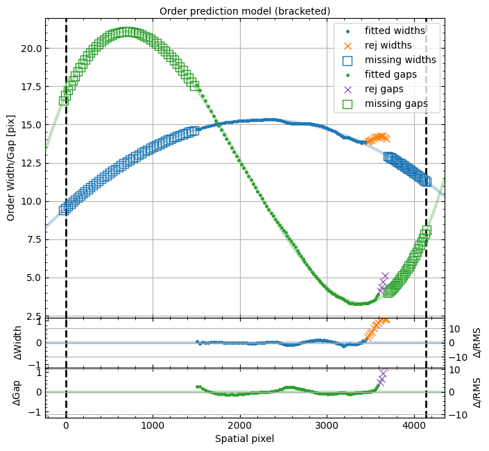

# Report 03 — First `run_pypeit` reduction via `pypeit_test`

**Date:** 2026-06-17
**Author:** JXP and Claude
**Data:** `RAW_DATA/shane_hamspec/Hamilton/` (the 7-frame setup)
**Task:** Prep #4 — generate a PypeIt file, register it in the dev suite, run
the reduction with `pypeit_test`, and report how far it gets.

Builds on [Report 02](02_pypeit_setup.md). The setup now yields a single,
correctly-typed configuration, so this is the first end-to-end reduction.

---

## 1. Dev-suite wiring (what was created)

To run through `pypeit_test`, the data set was given the standard dev-suite
layout `RAW_DATA/<instr>/<setup>/`:

- **Raw data** moved to `RAW_DATA/shane_hamspec/Hamilton/` (the 7 FITS were
  previously loose in `RAW_DATA/shane_hamspec/`). Setup name chosen:
  **`Hamilton`** (the Hamilton Echelle Spectrograph). Reversible; see Q&A 13.
- **Registered** the setup in `test_scripts/setups.py`:
  `all_setups['shane_hamspec'] = ['Hamilton']`. This auto-populates
  `_reduce_setups`, so a `reduce` test is created automatically; the dev suite
  derives `supported_instruments` from `all_setups`, so no other edit was
  needed. `./pypeit_test list` now shows `shane_hamspec`.
- **PypeIt file** written to
  `pypeit_files/shane_hamspec_hamilton.pypeit` (filename must be **lowercase**
  setup — the framework builds it via `setup.lower()`; my first try with
  `…_Hamilton.pypeit` failed with "Missing file"). Path line uses the
  dev-suite relative form `path ../shane_hamspec/Hamilton`, which the harness
  rewrites at run time.

The `.pypeit` data block (all 7 frames, single calib group, airmass populated):

| file | frametype | decker | exptime | airmass |
|------|-----------|:------:|--------:|:-------:|
| d2084, d2085 | arc,tilt        | 640:5.0 |  3 / 20 s | ~1.000 |
| d2090, d2095 | illumflat,trace | 640:5.0 |  4 / 25 s | ~1.000 |
| d2000, d2040 | pixelflat       | 800:6.0 |  3 / 22 s | ~1.000 |
| d2100        | standard        | 640:5.0 |   300 s   | 1.239  |

Command run by the harness:
`run_pypeit …/shane_hamspec_hamilton.pypeit -o`.

---

## 2. How far it got

Two reduction attempts were needed; each exposed one blocker.

### Attempt 1 — blocked immediately: no bias
`PypeItError: No bias available for bias subtraction!` while processing the
first trace flat. The data set has **no bias/dark** frames (flagged in
Report 01), but the inherited (HIRES-derived) processing defaults still
requested a bias.

**Fix applied** (in `shane_hamspec.default_pypeit_par`, mirroring Keck/HIRES):
```python
turn_off_on = dict(use_biasimage=False, use_overscan=True,
                   overscan_method='median')
par.reset_all_processimages_par(**turn_off_on)
```
i.e. subtract the 64-column, two-amp overscan (bias level ≈ 954 ADU, see
Report 01) instead of a bias frame, for **all** processed image types.

### Attempt 2 — ran the full calibration chain (≈ 3 min), stopped at wavecal
With overscan enabled the reduction proceeded all the way through the
calibrations and stopped exactly at the wavelength solution — "the hard part":

| Step | Result |
|------|--------|
| Metadata + user frame types | ✓ "passed the calibrations inspection" |
| Overscan / no-bias / no-dark | ✓ handled (warnings only) |
| **Edge tracing** | ✓ traced the echelle orders; removed 32 spurious edge traces; predicted missing orders → **171 orders/slits**; wrote `Edges` + `Slits` + order-prediction QA |
| Flat fielding | ✓ |
| Tilt image | ✓ `Tiltimg` written |
| Arc spectrum extraction | ✓ approximate arc extracted for **all 171 slits** |
| **Wavelength calibration** | ✗ `wavecalib.py:build_wv_calib: Finding the echelle orders` → **HTTP 404** fetching `lick_hamspec_angle_fits.fits` |

Calibration products written to `REDUX_OUT/shane_hamspec/Hamilton/Calibrations/`:
`Edges_A_0_DET01.fits.gz`, `Slits_A_0_DET01.fits.gz`, `Arc_A_0_DET01.fits`,
`Tiltimg_A_0_DET01.fits`.

### The wavecal blocker (this is the next development task)
`echelle` wavelength calibration calls `get_echelle_angle_files()`, which
returns two **archive** files that do not exist yet:
```
lick_hamspec_angle_fits.fits      # order spatial-position vs. XD-angle model
lick_hamspec_composite_arc.fits   # reference ThAr template per order
```
PypeIt tried to download `lick_hamspec_angle_fits.fits` from the GitHub
`hamspec` branch data dir and got **404 — Not Found**. These files must be
**built** from a good ThAr solution — precisely the purpose of the
`Arc_01_fit.idl` (XIDL), `Hamilton_ThArTi.pdf`, and `IRAF/` reference outputs
in `pypeitdev/shane_hamspec/`. That is the upcoming **Development → Wavelength
Calibration** effort.

At run time these still carried the **`lick_hamspec`** prefix (a relic of the
pre-rename class), which is what produced the 404 above. Per Q&A 14 they have
since been renamed in `get_echelle_angle_files()` to
**`shane_hamspec_angle_fits.fits`** / **`shane_hamspec_composite_arc.fits`**;
the archive files themselves still need to be built.

---

## 3. Edge-tracing / order model (QA)



The order-prediction QA (`Edges_A_0_DET01_orders_qa.png`) shows a well-behaved
order-width/gap model across the detector: fitted order **widths ≈ 9–15 px**
and the complementary **gaps** follow smooth low-order curves, with the
`add_missed_orders` machinery bracketing predicted (missing) orders at both
spatial ends. Fit residuals are small except at the high-spatial-pixel edge,
where several widths/gaps are rejected — the order solution is least reliable
at that edge. 171 orders is a lot (more than the ~50–90 estimated visually in
Report 01, because the predictor extrapolates beyond the illuminated orders);
whether all 171 should be kept is a tuning question for later (Q&A 15).

---

## 4. Summary

- **The spectrograph definition works through the entire calibration chain.**
  `pypeit_test reduce -i shane_hamspec` builds Edges, Slits, Arc, and Tiltimg,
  and reaches wavelength calibration. The only remaining blocker is the
  **missing wavelength-solution archive**, which is the dedicated next task.
- Changes made for this task: dev-suite registration (`setups.py`), raw-data
  layout (`Hamilton/` subdir), `pypeit_files/shane_hamspec_hamilton.pypeit`,
  and the no-bias/overscan default in `shane_hamspec.default_pypeit_par`.
- The dev-suite `reduce` test currently **fails** (expected) at wavecal; it
  will pass once the archive files exist (and/or the test is scoped to
  `calib_only` until then — Q&A 16).

---

## Q&A (answered by JXP)

13. **Setup name & data move.** I moved the 7 raw frames into
    `RAW_DATA/shane_hamspec/Hamilton/` and named the setup **`Hamilton`** (so
    the dev-suite file is `shane_hamspec_hamilton.pypeit`). Is `Hamilton` the
    name you want, and is moving the data on the external drive OK (it must
    also be mirrored on the Google Drive)?
    → **"This is fine for now."** Setup name `Hamilton` and the data move are
    kept.
14. **Archive file names.** `get_echelle_angle_files()` still returns
    `lick_hamspec_angle_fits.fits` / `lick_hamspec_composite_arc.fits`. Rename
    these to `shane_hamspec_*` when we build them?
    → **"Yes, rename them."** Done: `get_echelle_angle_files()` now returns
    `shane_hamspec_angle_fits.fits` / `shane_hamspec_composite_arc.fits` (the
    files themselves remain to be built in the wavelength-calibration step).
15. **171 orders.** Edge tracing keeps 171 orders (incl. predicted "missing"
    ones). Is that the expected order count for Hamspec, or should we restrict
    the spatial range / order count (e.g. drop the poorly-fit high-pixel edge)?
    → **Open / unknown** ("I actually don't know"). Revisit during wavelength
    calibration, when the physical order numbers become known and the
    poorly-fit high-spatial-pixel edge can be assessed.
16. **Dev-suite expectation for now.** Until the wavelength archive exists, the
    `reduce` test will fail at wavecal. Want me to register it as a
    **calib-only** test in the interim, or leave the full reduce test failing
    as a known TODO?
    → **"No need to do anything for now."** The full `reduce` test stays
    registered and is a known TODO that will pass once the wavelength archive
    is built.
