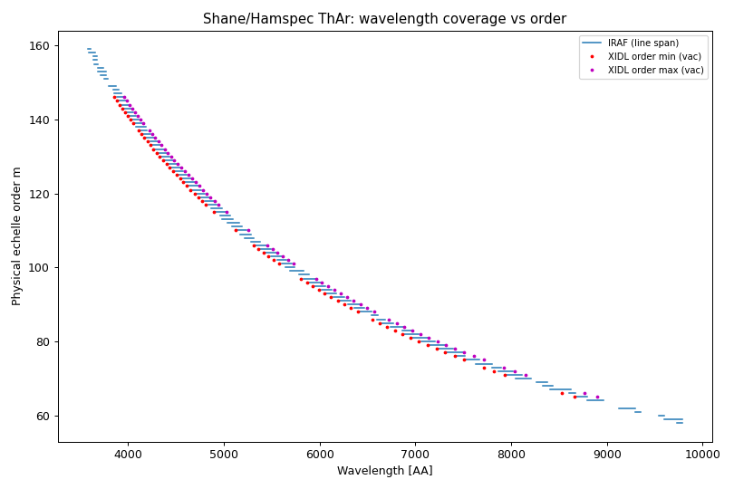
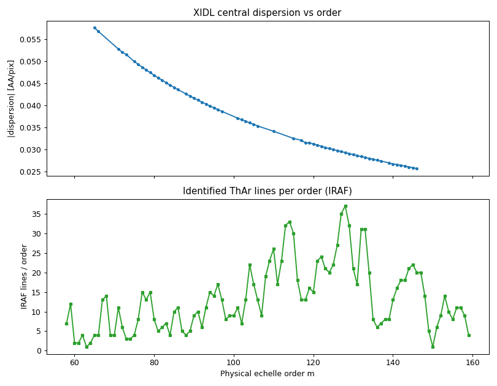
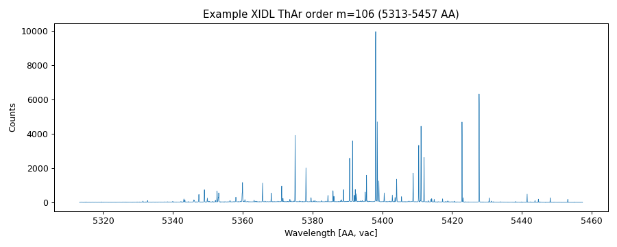
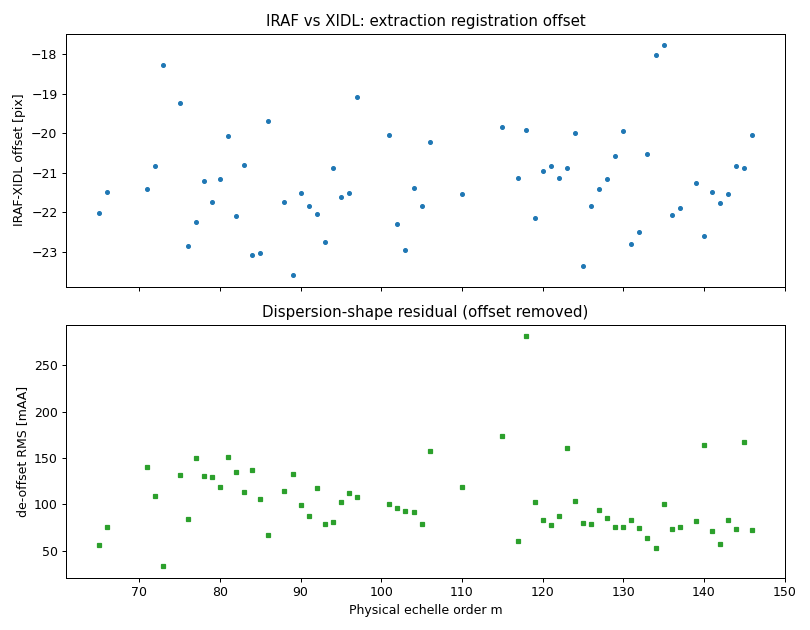

# Report 04 — Wavelength-calibration deep dive (Shane/Hamspec)

**Date:** 2026-06-17
**Author:** JXP and Claude
**Task:** Development / Wavelength Calibration #1 — examine the provided
wavelength reference files, characterize the ThAr solution, and lay out the
path to a PypeIt echelle archive.
**Scripts:** `pypeitdev/shane_hamspec/scripts/` (run with the `pypeit14` env)

This is the blocker identified in [Report 03](03_first_reduction.md): the
`echelle` wavelength step needs the archive files returned by
`get_echelle_angle_files()` (`shane_hamspec_angle_fits.fits`,
`shane_hamspec_composite_arc.fits`), which do not exist yet. We have **two
independent legacy reductions** of the same ThAr exposure to build them from.

---

## 1. Inputs examined

In `pypeitdev/shane_hamspec/`:

| File | What it is |
|------|-----------|
| `IRAF/ecTHAR20240125.rsfbo_1` | IRAF `ecidentify` **database** (text): 1355 identified ThAr lines + the global 2D Chebyshev solution. |
| `IRAF/THAR20240125.rsfbo_1.fits` | Extracted ThAr arc, **103 orders × 4096 pix** (equispec / pixel WCS). |
| `IRAF/THAR20240125.wrsfbo_1.fits` | Same, **MULTISPE** WCS — per-order wavelength solutions in 285 `WAT2` cards. |
| `Arc_01_fit.idl` | XIDL (HIRES/ESI-style) save: `guess_ordr`, `sv_aspec` (extracted arc), `sv_lines` (IDed lines), `all_arcfit` (per-order 1D fits). |
| `Hamilton_ThArTi.pdf` | Screenshots of the IRAF solution (human reference). |

**Key discovery:** PypeIt already ships a reader for the exact XIDL schema —
`pypeit.core.wavecal.templates.xidl_esihires()` — which evaluates the
per-order fits and returns `(orders, wave_vacuum, spec)` directly. This is the
single most useful fact for building the archive.

## 2. Scripts written (`scripts/`)

- **`parse_iraf_ecthar.py`** — parses the `ecidentify` database into a
  structured array of features `(aperture, order, pixel, λ_fit, λ_ref,
  weight)` plus the 2D-fit header/coefficients; `summary()` prints stats.
- **`read_xidl_arc.py`** — wraps `templates.xidl_esihires()` to load the XIDL
  `(orders, wave, spec)` and pulls the per-order RMS from `all_arcfit`.
- **`characterize_wavesoln.py`** — combines both, prints a comparison, and
  writes the figures below.

## 3. What the solution looks like

### Geometry / physics
- Cross-dispersed echelle; dispersion along columns (`specaxis=1`, confirmed
  in Report 01). **4096 pixels per order.**
- **Grating constant** `m·λ ≈ 5.71 × 10⁵ Å` (IRAF: median 570 663, fit
  constant 570 757; XIDL center: 571 145 — agree to ~0.1%). This is the single
  number that ties physical order number to wavelength.

### Coverage (Figure 1)
- **IRAF**: 102 orders, **physical order m = 58 → 159**, **λ ≈ 3577 – 9788 Å
  (air)**, 1355 lines (median 11 lines/order, range 1–37).
- **XIDL**: 64 orders, **m = 65 → 146**, **λ ≈ 3858 – 8899 Å (vacuum)**,
  median 10 lines/order (4–21).
- The two use the **same physical order numbering** (Figure 1: XIDL points sit
  inside the IRAF line spans). IRAF simply solved **more** orders — it adds the
  reddest (58–64) and bluest (147–159) that XIDL left out. So IRAF is the more
  complete catalog; XIDL is the more convenient (ready-made extracted spectra +
  vacuum wavelengths).

### Accuracy
- **IRAF** global 2D Chebyshev (xorder=5 in pixel, yorder=4 in order):
  residual **RMS 13 mÅ**, max 55 mÅ — i.e. ≈ 0.01 px, excellent.
- **XIDL** per-order 1D fits (CHEBY/POLY, order 2–5): **RMS ≈ 1 mÅ** median
  (≈ 35 mÅ worst order). Both are sub-pixel and mutually consistent.

### Dispersion (Figure 2)
- Central dispersion runs ≈ **0.026 Å/pix in the blue (m≈146)** up to
  ≈ **0.057 Å/pix in the red (m≈65)** — it grows toward the red as λ/m rises
  (a single order spans more Å). Line density peaks in the mid/red orders
  (per-order ThAr counts up to ~37; see Figure 2).

### Example order (Figure 3)
- A mid-format XIDL order (m=106, ~5310–5460 Å) showing the extracted ThAr
  spectrum on its vacuum-wavelength grid — clean, well-resolved lines; the
  per-order product a PypeIt archive needs.

## 4. What PypeIt needs, and how these map to it

`shane_hamspec` uses `wavelengths['method'] = 'echelle'` with
`get_echelle_angle_files()` → two archive files:

1. **`shane_hamspec_composite_arc.fits`** — a **reference ThAr spectrum per
   order with its wavelength solution**, used for reidentification by
   cross-correlation. **Directly buildable** from either reduction:
   - *XIDL path (easiest):* `templates.xidl_esihires('Arc_01_fit.idl')` already
     returns `(orders 65–146, wave_vac, spec)` — feed straight into the
     PypeIt archive builder. Covers 64 orders.
   - *IRAF path (most complete):* combine `THAR…rsfbo_1.fits` (raw extracted
     spectra) with the `ecTHAR` 2D solution (or the `wrsfbo` MULTISPE WCS) to
     get all 102 orders. More work to parse the MULTISPE/2D fit.
2. **`shane_hamspec_angle_fits.fits`** — maps an **order's spatial (cross-
   dispersion) position to the cross-disperser angle** so PypeIt can predict
   which physical orders land where for a given `xdangle` (GTILTRAW). **This is
   the gap:** we have data at **only one** cross-disperser setting
   (GTILTRAW = 9194). We can anchor that single setting (associate the traced
   orders with m = 58…159 via `m·λ`), but we cannot *fit* an order-vs-angle
   relation from one point. See Q&A.

The reidentification itself (matching the 171 traced orders from Report 03 to
physical m and assigning λ) is what failed at `build_wv_calib: Finding the
echelle orders`; it needs both files above.

## 5. IRAF vs XIDL compatibility (Q&A 18 / 19) — *new*

`scripts/compare_iraf_xidl.py` matches the **952** IRAF identified lines that
fall in the **64 orders common to both** reductions (m = 65–146): for each line
it converts the IRAF reference wavelength (air) to vacuum and looks up the XIDL
wavelength at that order/pixel.

**Result:**
- **Same physical order numbering and pixel direction.** The match only works
  with identical `m`; the flipped pixel mapping gives ~64 Å residuals, the
  direct mapping ~sub-Å — so both pipelines run blue→red with the same `m`
  (this *confirms Q19*).
- **A ~constant pixel-registration offset of ≈ −21 px (−0.74 Å)** between the
  two extractions (range −17.8 to −23.6 px across orders) — i.e. the pipelines
  defined the extraction pixel origin / trim differently.
- **After removing that per-order offset, the dispersion shapes agree to
  ≈ 93 mÅ RMS** (median; ≤ 0.28 Å worst order) — a couple of pixels, well
  within reidentification tolerance.

**Verdict (Q18): the two solutions are compatible.** The only real difference
is a roughly constant pixel shift between the two independent extractions —
exactly the quantity PypeIt's reidentification cross-correlation solves for
(see §6). Because the composite arc stores each order's `(wave, spec)` *as a
self-consistent unit*, we can safely **start from XIDL (64 orders) and extend
with IRAF (to 102 orders) later**, taking each order from a single pipeline
(never splicing XIDL wavelengths onto IRAF pixels, which would reintroduce the
21-px offset).

## 6. NIRES-style shift method (Q&A 20) — *new*

PypeIt offers two echelle wavecal routes; the prompt asks us to follow the
**NIRES** one:

- **`method='echelle'`** (current `shane_hamspec`, à la Keck/HIRES;
  `ech_fixed_format=False`): needs `get_echelle_angle_files()` →
  `angle_fits` + `composite_arc`. `wavecalib.identify_ech_orders()` uses the
  **`echangle`/`xdangle`** metadata + `angle_fits` to *predict* which orders
  land where and their wavelength solution, by evaluating fits of (order
  coverage vs `xdangle`) and (per-order wavelength coeffs vs `echangle`). This
  requires data at **many angle settings** to build — which we do **not** have
  (one setting only).
- **`method='reidentify'`** (Keck/**NIRES**; `ech_fixed_format=True`,
  `reid_arxiv='keck_nires.fits'`): ships a **single template** (per-order arc
  spectrum + wavelength solution). At reduction it **cross-correlates each
  observed order against the matching archive order, solving for a pixel
  shift**, then reidentifies and refits. No angle model needed.

**Why NIRES fits Hamspec here.** We have exactly one cross-disperser setting,
and (per Q17) observers change the cross-disperser only rarely (via the dewar
height). For a given setting the format is effectively fixed, so the NIRES
template-plus-shift approach is the right first solution — and the ≈ 21-px
XIDL↔IRAF offset measured in §5 is precisely the kind of registration the
cross-correlation `cc_shift_range` absorbs. This also matches the prompt's note
that we **won't** use the NIRES *2D* solution — just its shift/reidentify
mechanism with our composite arc as `reid_arxiv`.

**Caveat for `method='echelle'` path:** `wavecalib.py` currently has a leftover
`embed(header='line 741 wavecalib.py')` right after `identify_ech_orders`, which
would halt a reduction even once the angle files exist. The NIRES/`reidentify`
route avoids that branch (and the unbuildable `angle_fits`). Flagged in Q&A 22.

## 7. Recommended path (for the next task)
1. **Build a `reid_arxiv` composite arc** from the **XIDL** solution
   (`xidl_esihires` → 64 orders, vacuum λ + spectra), formatted like
   `keck_nires.fits`. Air→vacuum is already handled (XIDL/IRAF use **air**).
2. **Switch `shane_hamspec` wavecal to the NIRES recipe:**
   `method='reidentify'`, `reid_arxiv='shane_hamspec.fits'`, and treat the
   single setting as fixed-format (set the order vector from `m·λ`). Keep the
   echelle refit params (`ech_nspec_coeff`, `ech_norder_coeff`).
3. **Re-run** the Report-03 reduction and inspect `WaveCalib` QA — per-order
   RMS should approach the ~1–13 mÅ the legacy fits achieve.
4. **Extend to 102 orders** using the IRAF catalog once the XIDL-based archive
   is validated.
5. Later, if multi-setting support is needed, build the full HIRES-style
   `angle_fits` keyed on the **dewar height** (cross-disperser) and grating
   tilt — see Q&A 21.

## Figures
| File | Description |
|------|-------------|
| `04_fig1_coverage.png` | Wavelength coverage vs physical order (IRAF spans + XIDL points). |
| `04_fig2_dispersion_lines.png` | Dispersion (Å/pix) and ThAr lines/order vs order. |
| `04_fig3_example_order.png` | Example extracted XIDL ThAr order on its vacuum λ grid. |
| `04_fig4_iraf_vs_xidl.png` | IRAF↔XIDL registration offset (pix) and de-offset residual vs order. |

---

## Q&A

**Answered (Prep-7 / this update):**

17. *Single XD setting.* → Observers **can** vary the cross-disperser by
    changing the **dewar height**, though rarely; we must be prepared. ⇒ We
    adopt the NIRES single-template approach for the standard setting now
    (§6), and defer the full multi-setting `angle_fits` (which would key on
    dewar height, see Q21).
18. *Which reduction?* → **Compatible** (§5): build from **XIDL** first, then
    extend with **IRAF**. Done — see §5 for the compatibility analysis.
19. *Order numbering.* → **Confirmed** by JXP and by §5 (the line-by-line match
    only closes with identical `m`); record m = 58…159, `m·λ ≈ 5.71e5 Å`.
20. *NIRES shift.* → **Follow the NIRES method** (§6): a single `reid_arxiv`
    template + cross-correlation pixel **shift**, *not* the NIRES 2D solution.

**New questions:**

21. **`echangle`/`xdangle` mapping (important).** Since the cross-disperser is
    set by the **dewar height** (header `DHEITRAW`/`DHEITVAL`), the order
    *spatial* coverage is controlled by dewar height — so for a future
    `angle_fits`, **`xdangle` should map to the dewar height**, while the
    **grating tilt `GTILTRAW`** (which sets the along-dispersion wavelength)
    is really the **`echangle`**. Currently `init_meta` has
    `echangle = 0` (fixed) and `xdangle = GTILTRAW`. For the NIRES single-
    setting solution this doesn't bite, but should we re-map these meta keys
    (and `configuration_keys`) to `echangle ← GTILTRAW`,
    `xdangle ← DHEITRAW/DHEITVAL` for correctness and multi-setting support?
    → **Answered: yes, re-map.** Implemented in `shane_hamspec` (Report 05 §1):
    `echangle ← GTILTRAW`, `xdangle ← DHEITRAW`, and `configuration_keys =
    ['echangle','xdangle','binning']`.
22. **Leftover `embed()` in `wavecalib.py`.** The `method='echelle'` branch has
    a debug `embed(header='line 741 wavecalib.py')` after `identify_ech_orders`
    that would halt any reduction using that path. The NIRES/`reidentify`
    route avoids it; should I also remove that stray `embed` (separate, it
    affects all `method='echelle'` spectrographs)?
    → **Answered: yes, comment it out.** Done (`wavecalib.py`, the `embed` and
    the adjacent `reload(autoid)` are commented).

---

**Implementation outcome (Report 05):** the NIRES recipe was implemented and
the reduction now reaches and runs reidentification, but it **fails to match**
— the legacy archive is a *different instrument configuration* than the
dev-suite raw data (grating tilt 9308 vs 9194; dewar height 3780 vs 3970). See
[Report 05](05_wavecal_implementation.md) for details and Q&A 23–25.
