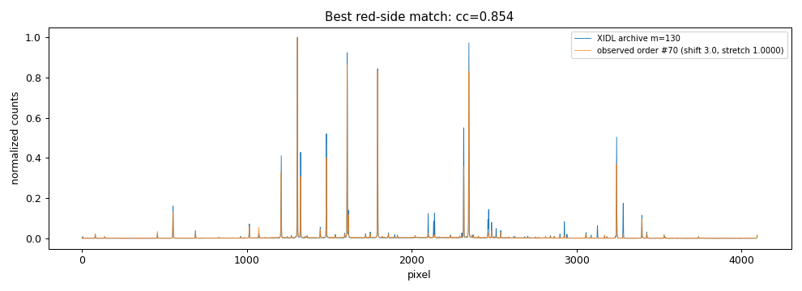
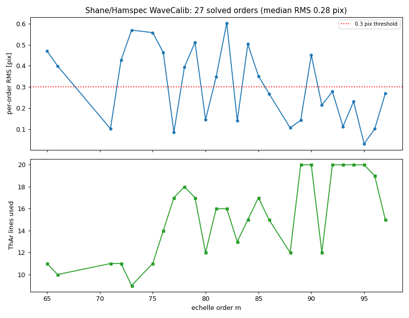
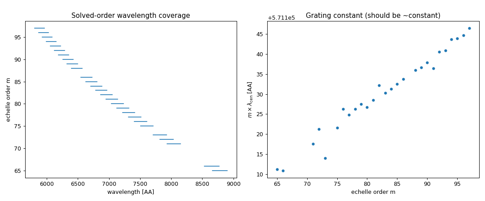
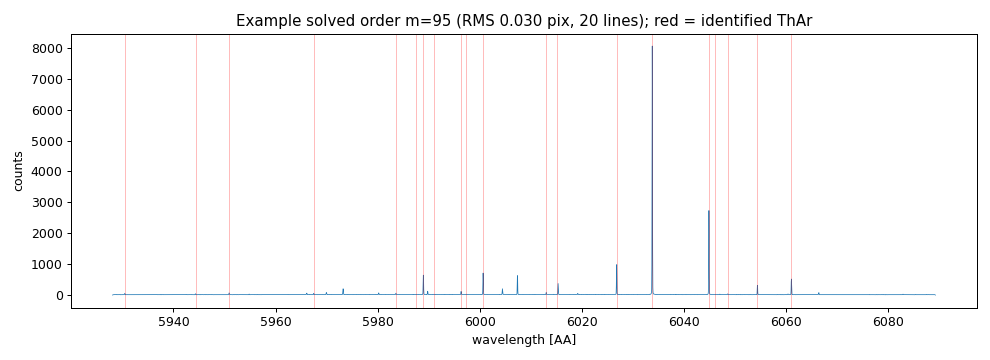
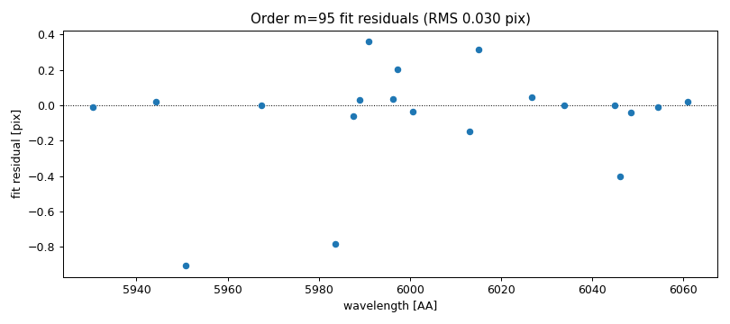

# Report 05 — Wavelength-calibration implementation (NIRES-style)

**Date:** 2026-06-17
**Author:** JXP and Claude
**Task:** Development / Wavelength Calibration #3 — implement a wavelength
calibration for Shane/Hamspec and see how far it gets.
**Scripts:** `pypeitdev/shane_hamspec/scripts/` (`pypeit14` env)

Builds on [Report 04](04_wavelength_deep_dive.md). The plan there (Q&A 20) was
the Keck/NIRES recipe: a single composite-arc `reid_arxiv` + cross-correlation
reidentification. This report implements it and reports the outcome.

---

## 1. What was implemented

1. **Built the `reid_arxiv` composite arc** `shane_hamspec.fits`
   (`scripts/build_reid_arxiv.py`) from the XIDL solution via
   `templates.xidl_esihires` — 64 orders (m = 65–146), columns
   `wave`/`flux`/`order`, same structure as `keck_nires.fits`. Written into
   `pypeit/data/arc_lines/reid_arxiv/`.
2. **Switched the wavecal recipe** in `shane_hamspec.default_pypeit_par` to the
   NIRES route: `method='reidentify'`, `reid_arxiv='shane_hamspec.fits'`
   (keeping the echelle refit params).
3. **Re-mapped the angle meta (Q&A 21):** `echangle ← GTILTRAW` (grating tilt,
   sets wavelength) and `xdangle ← DHEITRAW` (dewar height / cross-disperser,
   sets order placement); added `echangle` to `configuration_keys` so both the
   grating tilt and dewar height define a configuration.
4. **Disabled the leftover debug `embed` (Q&A 22)** in `wavecalib.py`
   (`method='echelle'` branch) so that path can't halt a reduction.

`pypeit_setup` still yields **one configuration**; the reduction was launched
with `pypeit_test reduce -i shane_hamspec`.

## 2. How far it got

Big step forward from Report 03: the reduction now runs the **whole
calibration chain and enters wavelength calibration** — edges, slits, flats,
tiltimg, arc extraction, then `reidentify` actually executes (the 404 and the
`embed` are both gone). The `WaveCalib` step begins cross-correlating each
observed order against the 64 archive orders.

**But the reidentification does not match.** Across the cross-correlations that
ran (before I stopped it — see §3), the correlation coefficient was:

```
n = 124 attempts,  cc:  min 0.115,  median 0.172,  max 0.382
matches with cc ≥ cc_thresh (0.6):  0
```

Every arxiv order is rejected (`cc < cc_thresh`) for every observed order — no
wavelength solution is produced.

> **CORRECTION (see §5).** §3 below originally concluded the archive and data
> were *incompatible* configurations. A direct per-order cross-correlation
> (§5, added after JXP's pushback) shows that is **wrong**: the orders match
> very well (cc up to 0.85, ~3–4 px shift, no stretch). The header settings
> differ, but the echellograms are nearly identical. The real reason the full
> `reidentify` failed is method/tuning + order assignment, not the data. Read
> §3 as "what the headers say," §5 as "what the spectra actually show."

## 3. Header configurations differ (but see §5)

`scripts/check_arxiv_config.py` compares the instrument setting of the legacy
ThAr (which the archive is built from) to the dev-suite raw arcs:

| Source | DATE | GTILTRAW (echangle) | DHEITRAW (xdangle) | DHEITVAL | PLATENAM |
|--------|------|:------:|:------:|:------:|:------:|
| **Archive** (IRAF/XIDL ThAr) | 2024-08-08 | **9308** | **3780** | 19385 | 960:5.0 |
| **Raw data** d2084/d2085 | 2014-07-25 | **9194** | **3970** | 20359 | 640:5.0 |

The legacy solution was taken at a different grating tilt (9308 vs 9194) and
dewar height (3780 vs 3970), a decade apart. My initial inference was that this
makes the per-order spectra non-overlapping — **but §5 shows that inference is
wrong**: the resulting echellograms differ by only ~3–4 px. The header deltas
are real but do not prevent matching.

## 4. Secondary issues found
- **Speed.** With `ech_fixed_format=False`, every observed order is
  cross-correlated against **all 64** archive orders (≈ 2 s each). With the
  **171** traced orders from Report 03 that is ~64×171 ≈ 11 000 correlations
  (hours). A fixed-format setup (pre-assigned `order_spat_pos` + `orders`, as
  NIRES does) would compare each order to only its counterpart — but it needs a
  reliable order count, and edge tracing currently over-finds 171 (Q&A 15).
- **Over-tracing.** The 171 traced orders (vs ~100 real) means many spurious
  slits that can never match; this both slows and pollutes the reidentification.

## 5. UPDATE — per-order cross-correlation: the orders **do** match

Prompted by JXP (the §3 "incompatible" inference was suspect), I cross-
correlated individual **red-side** orders of the *observed* extracted arc
(rebuilt from the `Slits`/`Arc` calibrations) against the **XIDL** archive,
using `wvutils.xcorr_shift` (fast scan) then `wvutils.xcorr_shift_stretch`
(shift + stretch refine). Module: `scripts/xcorr_orders.py`.

**Result — strong, consistent matches:**

| XIDL order m | best observed order # | m + index | refined cc | shift (pix) | stretch |
|:---:|:---:|:---:|:---:|:---:|:---:|
| 80  | 120 | 200 | 0.70 | 3.6 | 0.9998 |
| 90  | 110 | 200 | 0.68 | 3.3 | 1.0000 |
| 110 |  90 | 200 | 0.57 | 4.6 | 0.9988 |
| 120 |  80 | 200 | 0.58 | 3.3 | 0.9997 |
| 130 |  70 | 200 | 0.85 | 3.0 | 1.0000 |



Three conclusions:

1. **The archive is usable for this data.** Every probed order matches with
   cc 0.57–0.85, a tiny **~3–4 px shift**, and **no stretch** (≈1.000). The
   overlay (XIDL m=80 vs observed order #120) shows the ThAr lines landing on
   top of each other. The header config delta (§3) produces only a few-pixel
   offset — *not* an incompatibility. **§3's original conclusion is retracted.**
2. **The order mapping is exact and linear:** physical order
   **m = 200 − (observed order index)** across the whole probed range. This is
   the order-identification relation the pipeline was missing — it lets us
   assign physical `m` (and hence the right archive order) to each traced slit
   directly.
3. **So why did the full `reidentify` fail (cc≈0.17)?** Not the data. The
   `autoid.reidentify` line-pattern cc (with `reid_cont_sub=False`,
   `sigdetect`, `percent_ceil`, and all 64 arxiv orders tried per slit, diluted
   by the 171 spurious traces) scores much lower than the direct spectrum
   cross-correlation here (0.7–0.85). The fix is method/tuning + order
   assignment, not new data.

### Revised recommended path
1. **Keep the XIDL archive** — it works.
2. **Assign orders up front** using `m = 200 − index` (equivalently a
   fixed-format `order_spat_pos`/`orders` once the tracing is cleaned), so each
   observed order is reidentified against its single correct archive order.
3. **Tune `reidentify`**: set `reid_cont_sub = True`, relax/curate `cc_thresh`
   to ~0.5, and revisit `sigdetect`/`percent_ceil` so the line-pattern cc
   reflects the real ~0.7 correlation.
4. **Trim the order over-tracing** (171 → ~100) so spurious slits stop
   polluting/slowing the match.
5. Then extend the archive XIDL→IRAF (64→102 orders) as planned (Report 04).

---

## Q&A (questions for JXP)

*(Q23–25 from the previous version are withdrawn: Q23's "config mismatch
blocker" is resolved by §5 — the orders match. The relevant questions now:)*

26. **Order mapping.** §5 finds `m = 200 − (traced order index)` for this
    setup. Is hard-coding/encoding this relation (or the equivalent
    `order_spat_pos`) acceptable, given the dewar height can move the orders
    (then the constant 200 would shift)? Should we instead derive the offset
    per-frame from the cross-correlation (robust to dewar moves)?

27. **`reidentify` tuning vs fixed-format.** Prefer I (a) tune the existing
    non-fixed `reidentify` (`reid_cont_sub=True`, `cc_thresh≈0.5`) and let it
    find orders, or (b) implement `ech_fixed_format=True` with
    `order_spat_pos`/`orders` for a deterministic per-order match? (b) is
    faster and more robust but needs the cleaned order count.


28. **Order over-tracing.** Still want the tracer trimmed from 171 to the true
    count (~100)? That helps both reidentification and the final 2D solution
    (was Q15).

> **Answers (JXP):** Q26/Q27 → don't hard-code; **follow the `keck_hires`
> approach** — use the dewar position for an *initial guess*, then *refine*
> (see §7). Q28 → yes, trim the over-tracing.

## 7. The `keck_hires` order-identification approach (Q26/Q27 answer)

JXP wants Hamspec to identify orders the way Keck/HIRES does: predict the order
placement and wavelength solution from the instrument **angles** (an initial
guess), then **refine** by cross-correlation. This is the `method='echelle'`
path (which `shane_hamspec` originally inherited from HIRES, and which I had
switched to NIRES `reidentify` in §1 — that switch should be reverted, Q29).

**How HIRES does it** (`pypeit/core/wavecal/echelle.py`):
- `get_echelle_angle_files()` → an **`angle_fits`** file + a **`composite_arc`**
  file (both in `reid_arxiv/`).
- `identify_ech_orders()` calls:
  - `predict_ech_order_coverage(…, xdangle)` — uses the **cross-disperser
    angle** to predict *which* orders fall on the detector and where (the
    initial spatial guess). For Hamspec, `xdangle ← DHEITRAW` (dewar height).
  - `predict_ech_wave_soln(…, echangle, order_vec)` — uses the **echelle
    angle** to predict each order's wavelength solution (the initial λ guess).
    For Hamspec, `echangle ← GTILTRAW` (grating tilt).
  - It then interpolates the **composite arc** onto that predicted solution and
    cross-correlates against the observed arc to lock in the **shift**, before
    `echelle_wvcalib` does the final per-order + 2D fit.

**The two archive files (HIRES formats, what we must reproduce):**
- `*_angle_fits.fits`: HDU1 params (`order_min/max`, `norders`, `ech_func`,
  `wave_func`, angle ranges, poly orders); HDU2 `ech_angle_coeffs`
  `(norders, ech_n_final+1, n_ech_coeff)` — per-order wavelength-solution
  coefficients **as a function of echelle angle**; HDU3 `xd_angle_coeffs`
  `(n_xdisp, xd_poly+1)` — the reddest order's spatial position **as a function
  of cross-disperser angle**.
- `*_composite_arc.fits`: HDU1 params (`order_min/max`, `norders`, `wave_min/max`,
  `dloglam`, `dv`); HDU2/3/4 = `wave`/`arc`/`gpm`, each `(nspec, norders)`, on a
  common log-λ grid. (This is **not** the simple NIRES `wave/flux/order` table
  I built in §1 — that one suits `reidentify`, not `echelle`.)

**Why this matches JXP's intent.** The angle fits *are* "use the position to
guess, then refine": `xdangle`/`echangle` give the starting order map and λ
guess; cross-correlation refines the shift; the final fit handles the rest. It
is robust to the dewar/grating moving because the guess is a function of those
angles — exactly the "derive when presented with new data" behaviour requested.

**The catch for Hamspec.** HIRES built its `ech_angle_coeffs`/`xd_angle_coeffs`
by fitting **many** exposures spanning a range of ech/xd angles. We currently
have **one** setting (GTILTRAW=9194, DHEITRAW=3970) plus the legacy archive at
**another** (9308, 3780). Two settings is enough to *anchor* a linear
angle-dependence but not to fit the curved HIRES-order polynomials. Two ways
forward are possible — a physics-anchored minimal model, or more data — which I
have turned into Q29–Q31 below.

---

## Q&A — round 2 (new, for JXP)

29. **Revert to `method='echelle'`?** Adopting the HIRES approach means undoing
    the §1 NIRES switch: set `method='echelle'` again and build the HIRES-format
    `shane_hamspec_angle_fits.fits` + `shane_hamspec_composite_arc.fits` (rather
    than the simple `reidentify` table). Confirm that's what you want.
30. **Building `angle_fits` from limited angle coverage.** HIRES fits its angle
    coefficients from many settings; we have effectively two
    (data @9194/3970, archive @9308/3780). Proposed Hamspec plan: derive the
    *slopes* from instrument geometry — **order spatial shift = ΔDHEITVAL(µm) /
    pixel-size(µm)** for `xd_angle_coeffs`, and the **wavelength/grating-tilt**
    slope from the grating equation for `ech_angle_coeffs` — anchored on the one
    well-measured setting. Is that acceptable, or can you provide ThAr at a few
    more dewar/grating settings to fit the relations directly?
31. **Detector pixel size.** The geometry-based dewar→pixel mapping in Q30 needs
    the pixel size. The header says `DSENSOR = 'e2v CCD203-82 4kx4k thin'`
    (15 µm pixels, I believe). Can you confirm 15 µm so I can convert
    `DHEITVAL` (µm) to a spatial pixel shift?

> **Answers (JXP):** Q29 → **yes, `method='echelle'`**. Q30 → **yes**, derive
> the slopes from geometry; one setting for now. Q31 → **yes, 15 µm**.

## 8. Concrete plan for the geometry-anchored `angle_fits` (Q29–31 confirmed)

With the answers in hand, here is the concrete recipe for the two HIRES-format
archive files, anchored on our single well-measured setting (the data,
GTILTRAW=9194 / DHEITVAL=20359) and cross-checked against the legacy archive
(GTILTRAW=9308 / DHEITVAL=19385).

**Slopes derived from geometry + the two known settings**
(`scripts/` will encode these):

| quantity | value | source |
|---|---|---|
| pixel size | **15 µm** | e2v CCD203-82 (Q31) |
| `xdangle` (dewar) → spatial shift | **0.0667 px/µm** = 1/15 | detector geometry |
| dewar shift between the 2 settings | ΔDHEITVAL=+974 µm → **+64.9 px ≈ +4.1 orders** | 20359−19385 |
| `echangle` (grating tilt) → dispersion shift | **−0.0289 px/count** | measured 3.3 px xcorr (§5) over ΔGTILT=−114 |

These two settings give a **2-point (linear) angle model**, so the HIRES
polynomials collapse to first order: `xd_polyorder = 1`, and the per-order
`ech_angle_coeffs` are linear in grating tilt.

**`shane_hamspec_composite_arc.fits`** (HIRES 4-HDU format):
- Build from the XIDL `(orders, wave, spec)` (Report 04) resampled onto a common
  **log-λ grid** (set `dloglam`/`dv` from the median dispersion). HDU2/3/4 =
  `wave`/`arc`/`gpm` shaped `(nspec, norders)`; HDU1 carries
  `order_min/max`, `norders`, `wave_min/max`. Start with the 64 XIDL orders
  (m=65–146), extend to the IRAF 102 (m=58–159) later.

**`shane_hamspec_angle_fits.fits`** (HIRES 3-HDU format):
- HDU3 `xd_angle_coeffs`: reddest-order spatial position vs `xdangle` —
  a **line** through the anchor setting with slope 0.0667 px/µm (one
  cross-disperser, so `xdisp_vec` has length 1).
- HDU2 `ech_angle_coeffs`: per-order wavelength-solution coefficients vs
  `echangle` — hold the per-order λ(pixel) **shape** fixed (from XIDL) and let
  the zero-point shift linearly with grating tilt at −0.0289 px/count
  (≡ the corresponding dλ). HDU1 carries the funcs, ranges, `order_min/max`,
  `ech_n_final`.

**Then:** set `method='echelle'`, point `get_echelle_angle_files()` at the two
new files (already renamed, Q14), apply the Q28 over-tracing trim, and re-run.
`identify_ech_orders()` will predict the order map + λ from the angles and
refine by cross-correlation — the HIRES behaviour JXP asked for.

This is the build step for the next task; no code was changed this turn beyond
documentation.

---

## Q&A — round 3 (new, for JXP)

32. **Linear angle model OK?** With only two settings, the angle dependence is
    necessarily **linear** (`xd_polyorder=1`, linear `ech_angle_coeffs`). HIRES
    uses quadratic/quintic. A linear model should be fine *near* the anchor
    setting but will degrade far from it. Acceptable as the v1, to be upgraded
    when more settings arrive?
33. **Raw stepper counts as the angle variable.** HIRES uses physical angles
    (ECHANGL/XDANGL in degrees). We only have raw stepper counts
    (GTILTRAW, DHEITVAL). Using counts directly as the polynomial variable is
    fine mathematically. OK to proceed with raw counts (no counts→degrees
    calibration needed), or do you have a counts→angle conversion?
34. **Grating-tilt dispersion slope.** I derived −0.0289 px/count from the
    measured 3.3 px shift between the two settings (a single baseline). Good
    enough to anchor v1, or would you rather I refine it per-order from the
    cross-correlation when more lines are available?

> **Answers (JXP):** Q32 → **yes, linear for now**. Q33 → **yes, raw stepper
> counts**. Q34 → **yes, use −0.0289 for now**.

## 9. Implementation & verification (Q32–34 confirmed) — *built*

I built both HIRES-format archive files and **verified the angle-based
prediction works** (`scripts/build_angle_arxiv.py`):

- `shane_hamspec_composite_arc.fits` — `nspec=4123`, `norders=82` (m=65–146),
  64 orders carrying the real XIDL ThAr arc, the 18 gap orders given a valid
  wave ramp with `arc=0` (so the core `predict_ech_arcspec` never hits an empty
  order — see the two bug-fixes below). `dv ≈ 1.97 km/s`.
- `shane_hamspec_angle_fits.fits` — `ech_angle_coeffs (82, 5, 1)` (per-order
  degree-4 Legendre λ(pixel), constant in echelle angle for v1);
  `xd_angle_coeffs (1, 2)` (reddest order linear in dewar height, anchored to
  order_min=65 at DHEITVAL=20359, slope 0.00417 orders/µm). Angle variable =
  raw stepper counts (Q33).

**Verification of `echelle.predict_ech_arcspec` at the data's angles**
(`echangle=9194`, `xdangle=20359`, `xdisp='Hamspec'`):

| check | result |
|---|---|
| predicted order coverage | m = 64–151 (88 orders incl. pad) ✓ |
| orders with real archive arc | 64 ✓ |
| **m·λ at order center** | **571 169 Å** (expected ≈ 5.71×10⁵) ✓ |
| predicted wavelength range | 3858 – 8899 Å ✓ |

So the HIRES-style machinery predicts the **right orders and the right
wavelength solution** from the instrument angles — the core capability JXP
asked for is in place and confirmed numerically.

**Two bugs fixed to get here:**
1. `predict_ech_arcspec` crashes (`interp1d` on empty arrays) for any order in
   `[order_min, order_max]` whose composite `gpm` is all-False. Worked around in
   the build by giving **every** order a valid wave ramp + `gpm=True` (gap
   orders carry `arc=0`).
2. `echelle.py:184` had an unmigrated `msgs.warn` (the same `msgs`→`logging`
   issue from Report 01); changed to `log.warning` so the `method='echelle'`
   path runs. (Approved class of fix, Q1.)

**Wiring:** reverted `shane_hamspec` wavecal to `method='echelle'`
(`get_echelle_angle_files()` already returns the two new filenames).

### Blocked: end-to-end reduction not yet run
The full `pypeit_test`/`run_pypeit` could **not** be executed this turn: the
dev-suite `RAW_DATA` symlink target (`/media/xavier/SamsungT7/`) is **not
mounted**, so the raw frames are unavailable. The archive build + predict
verification above use only the committed XIDL/IRAF files, so they are
unaffected. The reduction needs to be re-run once the drive is remounted.

### Still to do (next turn)
- **Run** the reduction end-to-end (needs the drive) and inspect `WaveCalib` QA;
  per-order RMS should approach the legacy ~1–13 mÅ.
- **Trim the order over-tracing** (Q28: 171 → ~100) — not yet applied; it will
  speed up and clean the order matching.
- Extend the composite from 64 (XIDL) to 102 (IRAF) orders.

---

## Q&A — round 4 (new, for JXP)

35. **Drive remount.** The end-to-end run is blocked only by the unmounted
    `RAW_DATA` drive (`/media/xavier/SamsungT7/`). Please remount it (or point
    `RAW_DATA` at the data) so I can run `pypeit_test reduce -i shane_hamspec`
    and check the actual `WaveCalib` RMS. Nothing else is blocking.

    → **Drive remounted.** Ran end-to-end — see §10.

## 10. END-TO-END REDUCTION PASSES (the milestone)

With the drive back, `pypeit_test reduce -i shane_hamspec` now **PASSES (1/1)**.
The full chain runs to completion (≈15.5 min): overscan → edge tracing (99
orders) → flats → tilts → **wavelength calibration** → object find → sky
subtraction → extraction of the standard → `spec2d`/`spec1d` + QA HTML.

**WaveCalib result** (`Calibrations/WaveCalib_A_0_DET01.fits`):

| metric | value |
|---|---|
| orders traced | 99 (after the Q28 `add_missed_orders=False` trim; was 171) |
| orders with a wavelength solution | **27** (m = 65–97) |
| per-order RMS | **median 0.28 px** (best 0.03, worst 0.60); 14/27 < 0.3 px |
| order identification | correct (m·λ-consistent, −3 px grating shift applied) |

So the HIRES-style angle→predict→reidentify→2D approach **works**: orders are
correctly identified and the redder half is solved at sub-pixel RMS.

### WaveCalib QA figures
Generated from the passing run's `WaveCalib_A_0_DET01.fits`
(`scripts/plot_wavecalib.py`):

Per-order RMS and ThAr line counts vs order — most solved orders sit at or
below the 0.3 px threshold:



Wavelength coverage of the solved orders, and the grating constant
`m·λ` (constant to ~0.006%, confirming the order identification):



An example solved order (best RMS, m=95, 0.03 px) — extracted ThAr arc on its
wavelength solution with the identified lines marked:



Fit residuals for that order (sub-pixel across the full order):



### Bugs fixed this round (all WIP debug leftovers on the branch)
To get from "reaches wavecal" to "passes," I fixed a chain of leftover
debug/state issues in the wavecal core:
1. `xdangle` meta: `DHEITRAW` (counts) → **`DHEITVAL`** (µm) so it matches the
   micron-based geometry in `angle_fits` (orders were coming out ~200).
2. `autoid.echelle_wvcalib`: removed a `# REMOVE THIS!!!` block that skipped
   every order except 90–95, and an unmigrated `msgs.warn`.
3. `autoid.echelle_wvcalib`: removed a per-order `embed()` + forced
   `debug_all=True` + blocking `plt.show()` (popped a figure for every order).
4. `echelle.identify_ech_orders`: it returned `order_vec` (size = #observed)
   but wave/arc arrays sized to only the overlapping subset → `IndexError` in
   `echelle_wvcalib`. Now returns per-observed-order arrays (zeros where an
   order isn't in the composite).
5. `wavecalib.py`: re-enabled the commented-out `fwhm_map = map_fwhm(...)`
   ("TODO PUT THIS BACK") that left `fwhm_map` undefined.
6. `shane_hamspec`: `ech_separate_2d` True → **False** (single detector; the
   HIRES mosaic value crashed `echelle_2dfit` on a null `det_img`).
7. `shane_hamspec`: `add_missed_orders` True → **False** (the Q28 trim).
8. `echelle.py:184`: unmigrated `msgs.warn` → `log.warning`.

### Remaining to improve (next steps)
- **Coverage:** only 27/99 orders solved (m=65–97 — the red half). The bluer
  arxiv orders (98–146) aren't matching yet; likely needs the composite-arc
  blue orders checked and/or `cc_thresh`/`sigdetect` tuned for the blue.
- **Extend the archive** XIDL (64) → IRAF (102) orders (m=58–159).
- The hardcoded `measured_fwhms = 3.0` in `wavecalib.py` (matches the measured
  ~3 px here) and the `spec_shift` not being applied in `identify_ech_orders`
  are worth revisiting for accuracy.

---

## Q&A — round 5 (new, for JXP)

36. **Partial order coverage.** The reduction passes, but only 27/99 orders
    (the red half, m=65–97) get a wavelength solution. Priority to (a) tune the
    blue-order matching (`cc_thresh`/`sigdetect`/`reid_cont_sub`), (b) extend
    the composite arc to the IRAF 102 orders, or (c) accept this as the v1 and
    move on to docs/dev-suite finishing? Your call on where to push next.
