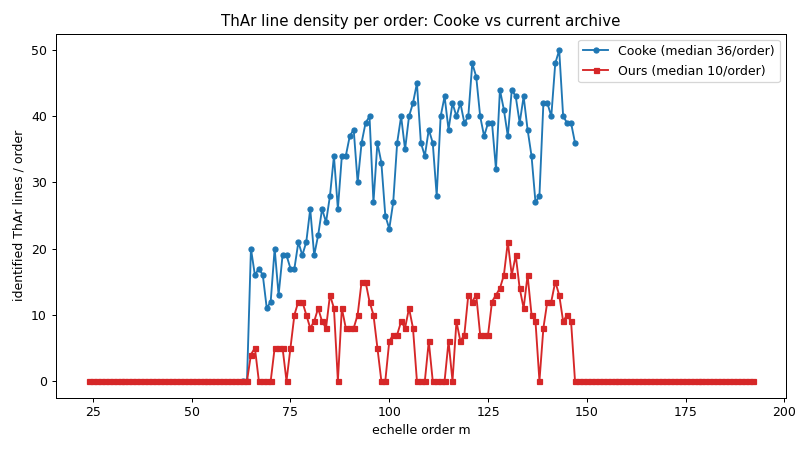

# Report 06 — Cooke XIDL reduction: lessons for our wavelength calibration

**Date:** 2026-06-25
**Author:** JXP and Claude
**Data:** `pypeitdev/shane_hamspec/Cooke_data/redo_from_scratch/`
**Task:** WaveCal #12 — inspect the Cooke XIDL hamspec reduction and assess how
it can improve our wavelength calibration.
**Code:** `scripts/redo_from_scratch.py` (inspection); a `cooke` option added to
`scripts/build_angle_arxiv.py` (archive build test).

---

## 1. What the folder is

A complete **XIDL** (Hamilton-pipeline) reduction of a hamspec dataset from
**UT 16 Nov 2010**, **binned 2×1** (2048 spectral pixels). It follows the
standard `hamspec_*` XIDL recipe (documented in `ryans_notes.log`):
`hamspec_strct` → `crds` keyword edits → flats (`mkflats`/`edgeflat`/`nrmflat`)
→ arcs → object extraction. Products: `Arcs/`, `Flats/`, `Extract/`, `FSpec/`,
`Final/`, plus QA PostScript.

The wavelength solution is `Arcs/Fits/Arc_01_fit.idl` — the same XIDL format we
already read with `pypeit.core.wavecal.templates.xidl_esihires`, plus a 2-D fit
`Arc_01_fit2D.fits` and order traces in `Arcs/TRC/`.

## 2. The Cooke wavelength solution is far richer than ours

`scripts/redo_from_scratch.py` reads both solutions and compares them:

| | **Cooke (16Nov10)** | **Ours (current archive)** |
|---|---|---|
| valid orders | **80** (m=65–147) | 64 (m=65–146) |
| ThAr lines/order (median) | **36** (max 50) | 10 (max 21) |
| lines/order in the blue (m≳110) | **~39** | ~5–15 |
| per-order RMS | ~5.6 mÅ | ~1.1 mÅ |
| binning / npix | **2×1 / 2048** | 1×1 / 4096 |

The Cooke reduction identifies **~3.6× more ThAr lines per order**, and
crucially it keeps that density **all the way into the blue** — exactly the
orders our archive fails to solve (Report 05 §11). (Our solution has lower
per-order RMS, but with far fewer lines, so its blue orders are too line-poor
to register in the reidentification cross-correlation.)

## 3. Test: building the archive from Cooke — and why it failed

I added a `cooke` source to `build_angle_arxiv.py` that loads the Cooke solution
and **resamples it 2048→4096** (`xidl_esihires(..., specbin=2)`) to match the
dev-suite 1×1 binning, then ran the full reduction.

**Result: the reduction FAILED — `No successful 2D Wavelength fits`.** The
reidentification cross-correlation failed for **every** order (even the red
ones that solve fine with our XIDL archive).

**Why:** the Cooke arc is 2×1 binned. Resampling 2048→4096 by interpolation
**doubles the effective line width** (~3 px → ~6 px), so the archive lines no
longer match the native 1×1 observed arc's ~3 px lines, and the line-pattern
cross-correlation collapses. The richer line list does not help if the arc
*spectrum* it is attached to has the wrong line width.

So a line-rich archive at the **wrong binning cannot be used directly** as a
cross-correlation template.

## 4. How this improves ours (the actionable lessons)

The Cooke reduction is the **best wavelength reference we have** — but its value
is the **identified line list** (pixel→wavelength per order, dense into the
blue), *not* its 2×1 arc spectrum. Concretely, to fix our blue coverage:

1. **Use Cooke's per-order line list, not its arc.** Its `sv_lines`
   (pix, wave per order, ~36/order incl. blue) can seed `pypeit_identify` on
   our native 1×1 dev-suite arcs (d2084/d2085), producing a line-rich **1×1**
   solution that we archive. This sidesteps the binning problem.
2. **The real need is a line-rich ThAr at 1×1.** All three legacy solutions we
   have (our XIDL @1×1 but line-poor; the IRAF set; Cooke @2×1 line-rich) are
   each missing one ingredient. The clean fix is one good 1×1 ThAr reduction
   with deep line identification — which Cooke's line list makes
   straightforward to bootstrap.
3. **Don't naively resample across binning** for reidentification templates —
   match the binning (or down-sample the data, not up-sample the template).

## 5. Status
Reverted to the working XIDL archive (Report 05 baseline: **27 orders solved,
m=65–97, dev-suite PASS**). The Cooke inspection code (`redo_from_scratch.py`)
and the `cooke` build option are kept.

---

## Q&A — round 7 (new, for JXP)

38. **Path to blue coverage via Cooke's line list.** The most promising route
    is to use Cooke's dense per-order ThAr line identifications to bootstrap a
    **native 1×1** solution on our dev-suite arcs (via `pypeit_identify`,
    seeded by Cooke's pix→wave), then archive that. Shall I pursue this? It is
    more involved than the archive swaps tried so far but directly targets the
    blue orders.
39. **Or down-bin the data to match Cooke?** Alternatively we could reduce the
    dev-suite arcs at 2×1 (binning the 4096→2048) to match the Cooke template
    directly. That is simpler but changes the dev-suite reduction binning — do
    you want the dev-suite test to run at 1×1 or would 2×1 be acceptable?
40. **Is a 1×1 line-rich ThAr available?** Do you have (or can you reduce) a
    ThAr at the dev-suite 1×1 binning with deep line identification? That would
    be the cleanest input and avoid all the cross-binning workarounds.
