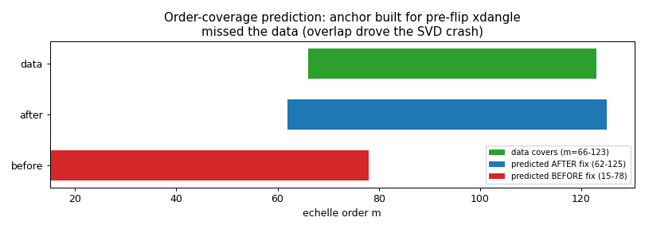
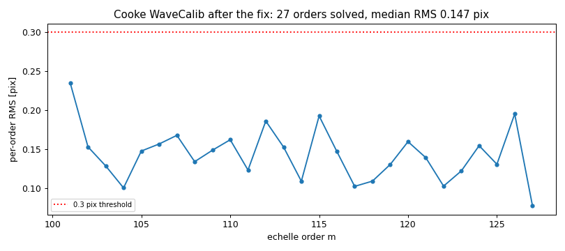

# Report 08 — Diagnosing the Cooke 2-D wavecal SVD failure

**Date:** 2026-06-29
**Author:** JXP and Claude
**Task:** WaveCal #15 — dig into the `echelle_2dfit` SVD crash on the Cooke
data ("not as simple as the RMS tolerance").
**Scripts:** `scripts/plot_svd_diagnosis.py` (+ a temporary dump in
`wavecalib.echelle_2dfit`, since removed)

## 1. The symptom

On the Cooke (Loral 2Kx2K) reduction the per-order wavelength calibration ran
(58 orders extracted) but the **2-D fit crashed**:
`arc.fit2darc → numpy.linalg.LinAlgError: SVD did not converge`, preceded by
`RuntimeWarning: invalid value encountered in divide`.

## 2. What actually fed the 2-D fit

I dumped the `fit2darc` inputs just before the failing call. They were:

```
n = 16 lines,  unique orders = 1  (order 67),  no NaNs
```

`fit2darc` fits `order × wavelength` as a 2-D Legendre in (pixel, order) and
**normalises the order axis by (max_order − min_order)**.  With a single unique
order that denominator is **zero** → `invalid value in divide` → NaNs in the
design matrix → `SVD did not converge`.  So the crash is a *degenerate fit*: only
one order survived to the 2-D stage, not an RMS-threshold issue.

## 3. Why only one order survived

Of the 58 observed orders, **43 reported "order … not present in the arxiv"**
(their predicted archive arc was all zeros) and only ~15 were reidentified, of
which just one passed the fit.  Tracing that back: `identify_ech_orders` predicts
the order coverage from `angle_fits` and then matches the data to it.  The
predicted window was **m = 15–78**, but the data covers **m = 66–123** — they
barely overlap (Figure 1, red vs green), so almost every order had no archive
arc to match.

**The root cause is the `angle_fits` anchor.** Its cross-disperser model was
built with `xd_xmin/xmax = 18359/22359` — i.e. for the **pre-flip** `xdangle`
(the dewar height `DHEITVAL` ≈ 20359 µm).  But after the Q43 flip the reduction
passes `xdangle = GTILTRAW = 9085` (raw grating-tilt counts).  Evaluating the
linear xd model **far outside its fitted range** extrapolated wildly and
predicted the reddest order at ~17 instead of ~65.  (The cross-correlation then
reported a 46-order "shift", a tell-tale that the prediction was ~46 orders off.)



### A second, sneaky factor
PypeIt resolves `reid_arxiv` files from the **reduction directory first**, then
the package data dir.  The Cooke setup folder held its own (old-anchor) copy of
`shane_hamspec_angle_fits.fits`, so rebuilding only the *package* copy had no
effect — the run kept using the stale local file.  The fix has to update the
local copy too.

## 4. The fix

In `scripts/build_angle_arxiv.py` (the Cooke source):
- anchor the angle model at the **Cooke** angles in the **flipped** cards —
  `XD_ANCHOR = 9085` (GTILTRAW), `ECH_ANCHOR = 1700` (DHEITRAW), with the angle
  ranges bracketing them;
- since only **one** cross-disperser setting exists and `xdangle` is now grating
  tilt in raw counts (not microns), drop the old geometric orders/µm slope and
  use a **constant** order-coverage model anchored at `order_min` — the
  per-order reidentification cross-correlation supplies the rest.

After rebuilding (and copying the corrected archive into the Cooke setup folder
so the local copy is used), the prediction covers **m = 62–125**, matching the
data (Figure 1, blue).

## 5. Result — the Cooke reduction now completes

`run_pypeit` runs end-to-end ("Data reduction complete"): the 2-D fit now sees
**27 orders** (1269 lines) instead of one, and the standard is extracted.

| metric | before | after |
|--------|:------:|:-----:|
| unique orders into 2-D fit | 1 | **27** |
| 2-D fit | SVD crash | converges |
| per-order RMS (solved) | — | **median 0.147 px**, all 27 < 0.3 px |
| orders solved | — | 27 (m = 101–127) |



The per-order RMS (0.147 px median) is actually **better** than the 2014 e2v
result (0.278 px).

## 6. Still open
- **Coverage:** 27/58 orders solve (the bluer m≈101–127 end). The redder
  orders (m≈66–100) still don't match well — the same partial-coverage issue
  seen with the 2014 data, now at the opposite end. Worth a follow-up (per-order
  match diagnostics, composite-arc quality by order).
- The temporary `echelle_2dfit` dump has been removed; no debug code remains.

---

## Q&A — round 7 (new, for JXP)

45. **Guard `fit2darc` against degeneracy?** Independent of this data issue, a
    single surviving order makes `arc.fit2darc` crash with an opaque SVD error.
    Worth a small guard in core PypeIt (require ≥ 2 unique orders, else a clear
    message) — want me to add it, or leave core untouched?
46. **Push the redder-half coverage (m≈66–100)?** Same kind of partial-coverage
    limit as before. Diagnose the per-order matching for those orders next, or
    accept the 27 solved orders for now and move to dev-suite finishing?
