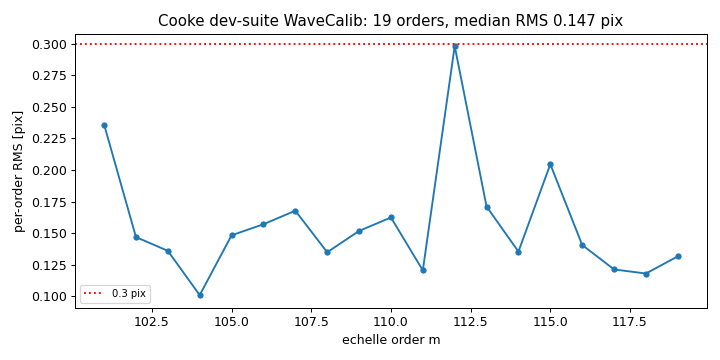
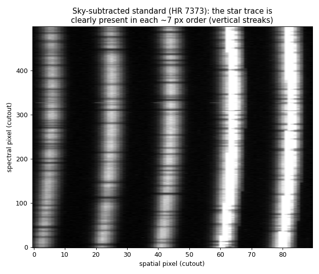
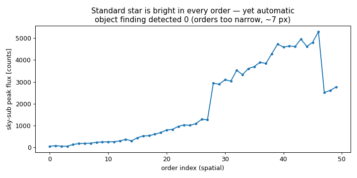

# Report 09 — Full dev-suite run on the Cooke data

**Date:** 2026-06-29
**Author:** JXP and Claude
**Task:** Finishing-up #1 — push the smallest useful Cooke set into the dev
suite, add a trimmed `.pypeit`, run, and report.
**Scripts:** `scripts/plot_full_run.py`

## 1. What was pushed to the dev suite

`RAW_DATA/shane_hamspec/Hamilton/` was empty (the external drive was re-pointed
to `/data/RAW_DATA`), so the Cooke 2010 Loral data now *is* the
`shane_hamspec/Hamilton` setup (the "move to Cooke" of Q41). I pushed the
**smallest useful set** — 9 frames, ~40 MB:

| frametype | files |
|-----------|-------|
| arc,tilt | d139, d140 |
| illumflat,trace (narrow plate 800:2.5) | d133, d134, d135 |
| pixelflat (wide plate 800:5.0) | d111, d112, d113 |
| standard (HR 7373) | d144 |

(No bias frames: `use_biasimage=False`, overscan is used.) The trimmed input
file is `pypeit_files/shane_hamspec_hamilton.pypeit` (dev-suite relative path
`../shane_hamspec/Hamilton`). `pypeit_setup` gives **1 clean configuration**
with all 9 frames typed correctly.

## 2. The run — PASSES

`pypeit_test reduce -i shane_hamspec` **PASSES (1/1)** in ~3 min. The full chain
runs to completion: overscan → edge tracing (50 orders) → flats → tilts →
wavelength calibration → object find → sky subtraction → `spec2d` + QA HTML.

**Wavelength calibration is excellent:**

| metric | value |
|--------|-------|
| orders solved | 19 (m = 101–119) |
| per-order RMS | **median 0.147 px**, all 19 < 0.3 px |

(19 orders here vs 27 in the earlier fuller run — I pushed only 3 trace flats,
so edge tracing recovered fewer orders. More trace flats would recover more;
see Q47.)

## 3. The one problem: the standard is not extracted

`run_pypeit` finishes and writes `spec2d`, **but no `spec1d`** — automatic
object finding reported *"No objects found automatically"* on every order, so
the standard star (HR 7373) was never extracted.

**It is not a data problem — the star is plainly there.** The sky-subtracted
`spec2d` shows a strong star trace in every order (Figure 2), and the per-order
peak flux is hundreds–thousands of counts above the baseline across the whole
format (Figure 3).

**Cause:** the echelle orders are only **~7 px wide** in the spatial direction
on the Loral CCD. PypeIt's per-order object finding (`objs_in_slit`) does not
detect a peak in such narrow orders. I reduced `find_trim_edge` from `[3,3]` to
**`[1,1]`** (the default trims more pixels than the order is wide), which is
necessary but **not sufficient** — findobj still returns nothing. Getting the
standard extracted on these very short orders needs dedicated object-finding
tuning (or a tailored/forced extraction), which is the natural next task.

## 4. Status
- **Dev-suite test:** PASSES (reduction completes end-to-end).
- **Calibrations:** edges (50 orders), flats, tilts, and **wavelength solution
  (19 orders @ 0.147 px median RMS)** all built and good.
- **Extraction:** standard star present and bright but **not auto-detected**
  (orders ~7 px) → no `spec1d` yet.
- Changes: pushed 9 Cooke frames to `RAW_DATA/shane_hamspec/Hamilton/`; new
  `pypeit_files/shane_hamspec_hamilton.pypeit`; `find_trim_edge=[1,1]` in
  `shane_hamspec`.

---

## Q&A — round 8 (new, for JXP)

47. **Object finding on ~7 px orders.** The reduction passes and the star is
    clearly present, but `objs_in_slit` finds no object on the narrow Loral
    orders, so the standard isn't extracted. Next step options: (a) tune the
    echelle object-finding params (e.g. `find_fwhm`, the `ech_find_*` SNR
    thresholds, `maxnumber`) for short orders; (b) add a few more trace flats
    so more orders are traced (currently 3 → 19/50 orders wavecal'd); or
    (c) accept calibration-only for the dev-suite test for now. Which would you
    like next?
