# Subaru/MOIRCS in PypeIt: HK500 reduction report

*J. X. Prochaska and Claude (Opus 5.5), 2026-10-02.  Branch
`subaru_moircs`.*

## Summary

The dev-suite HK500 MOS data reduce end to end on **both detectors in a
single run**.  The quality of each step is summarized below; figures are
in [`report_HK500/`](report_HK500/), and the numbers are in
[`report_HK500/summary.json`](report_HK500/summary.json).

| Step | Result | Verdict |
|---|---|---|
| Slit tracing | 39/39 slits found (32 science + 7 alignment boxes); matches the mask image | good |
| Wavelength calibration | 32/32 science slits; fit RMS 0.24–0.43 px (median 0.35 px ≈ 2.7 Å) | good |
| Slit-to-slit wavelength consistency | 0.9 Å (0.12 px) robust scatter | good |
| Tilts | RMS ≈ 0.02 px (e.g. slit 852) | good |
| Pixel flat | 1.2–1.3% robust scatter; ±5% artefacts at the ends of each slit's spectral coverage | needs a look |
| A−B sky subtraction | χ robust std 0.91–0.94; 0.03–0.04% of pixels with \|χ\|>5 | good; noise is slightly overestimated |
| Object finding / extraction | 5 objects per exposure; A and B spectra agree | works; targets are faint (S/N ≈ 0.5–1.8 per pixel in 180 s) |
| Fluxing, coadding | not tested (no standard star in the dev-suite data) | open |

The two things to follow up are the flat-field artefacts and possible
second-order light beyond 2.3 µm (see [Concerns](#concerns)).

## Data

The `RAW_DATA/subaru_moircs/HK500` data are one MOS mask
(`MO17A_COSMOS2`) observed with the HK500 grism:

- 3 lamp-on and 3 lamp-off dome flats;
- a mask image (not used);
- one A-B pair of 180 s science exposures with a 3″ `LINE2` dither.

Each exposure is written as two files, one per detector.

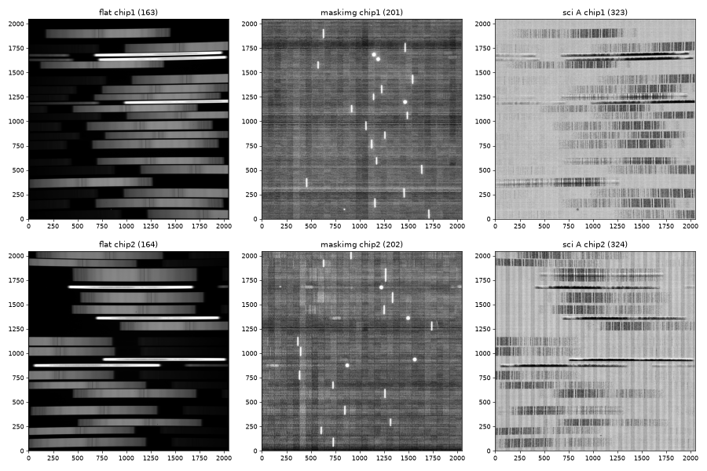

*Figure 1.  Raw flat, mask image, and A−B science frame for both chips.
Spectra run along x.  The bright narrow spectra come from the
alignment-star holes.*

## What was developed

- **Two detectors in one exposure.**  MOIRCS writes each chip to its own
  file.  The PypeIt file lists only the chip-1 file.  For DET02,
  `get_rawimage` opens the companion file (frame number + 1) and checks
  `DET-ID` and `EXP-ID`; a missing or wrong file raises an error.
  `pypeit_setup` drops the chip-2 files (`valid_configuration_values`).
  The spec2d and spec1d files hold both detectors, and `detnum = 2`
  reduces chip 2 alone (tested).  The chips are **not** mosaicked: the
  two channels are optically independent.
- **Frame typing.**  `DATA-TYP` is refined by `OBJECT` to tell apart
  lamp-on flats, lamp-off flats (`lampoffflats`), and the mask image
  (ignored).
- **A−B pairing** comes from the `K_DITPAT`, `K_DITCNT`, and `K_DITWID`
  cards.  Each frame is paired with the closest-in-time frame at the
  other dither position.
- **Bad-pixel mask.**  The NAOJ masks (IRAF PLIO format) were decoded
  with a one-off Python decoder.  The imaging beam-splitter shadow was
  removed, because the flats show real spectra there (Figure 10).
- **Wavelengths** use the `reidentify` method against a new 19-slit OH
  archive, `subaru_moircs_HK500.fits`.  Other changes: flexure is off,
  `snr_thresh = 5`, and there are 9 unit tests.  The docs were
  rewritten.

## Reduction quality

### Slit tracing

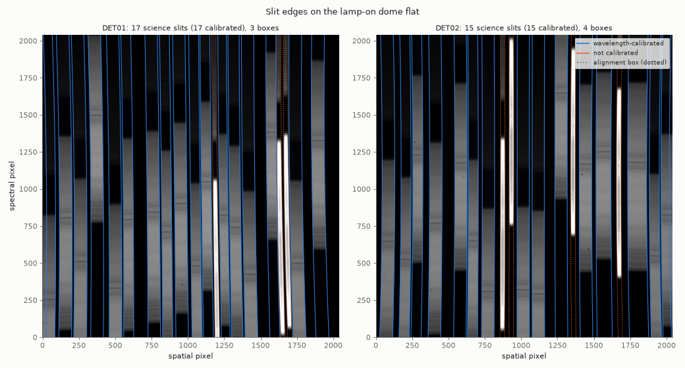

*Figure 2.  Slit edges on the lamp-on flat.  Blue = wavelength
calibrated, orange = not calibrated, dotted = alignment box.*

Edge tracing finds **every slit in the mask**:

- DET01: 17 science slits and 3 boxes.
- DET02: 15 science slits and 4 boxes.

This matches a count of the slits in the mask image.  The alignment
boxes (about 4.4″) are flagged `BOXSLIT` and not reduced as science.
Where a box sits next to a science slit at the same spatial position
(e.g. DET01 near x ≈ 1650), both are still traced separately in this
mask.

### Wavelength calibration

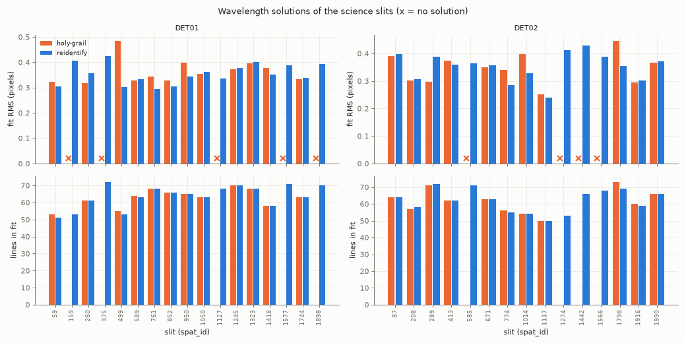

*Figure 3.  Fit RMS and number of lines per science slit, for
holy-grail (orange) and the final `reidentify` (blue).*

- **holy-grail** solved 12/17 (DET01) and 11/15 (DET02) science slits.
  The failures are slits whose spectra cover only part of the HK500
  range.
- **reidentify** (final) solves **17/17 and 15/15**.  The RMS is
  0.24–0.43 px, with a median of 0.35 px (≈ 2.7 Å, or ≈ 0.07 of the
  ~5 px line FWHM).  The median number of lines per slit is 63–65.
  Where both methods solve a slit, their RMS is about the same.
- A single `full_template` was also tried and rejected.  It gave
  rms 0.4–1.0 px and several solutions off by about 1100 Å.

Example fits (PypeIt QA):

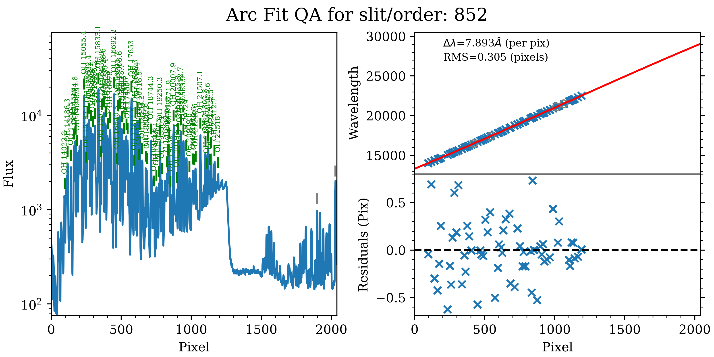
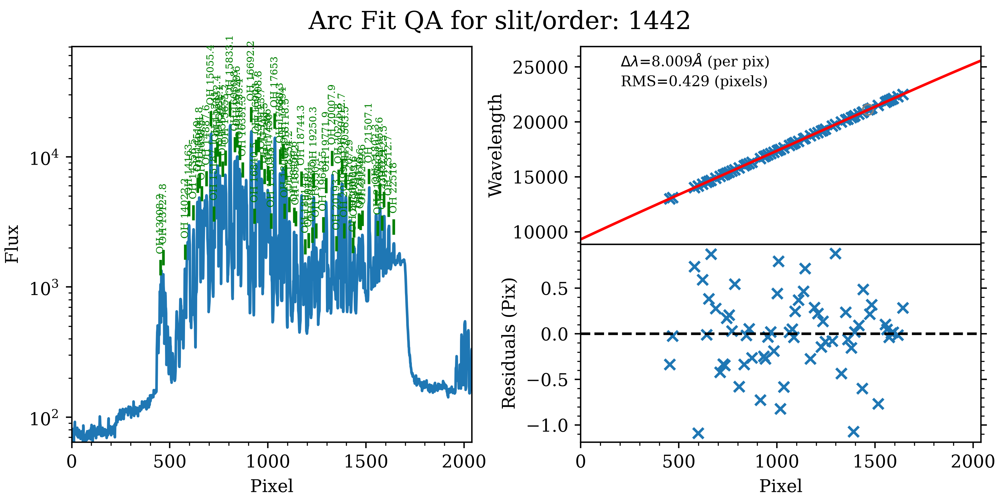

*Figure 4.  `Arc_1dfit` QA for slit 852 (DET01) and slit 1442 (DET02).
The second slit is one that holy-grail could not solve.*

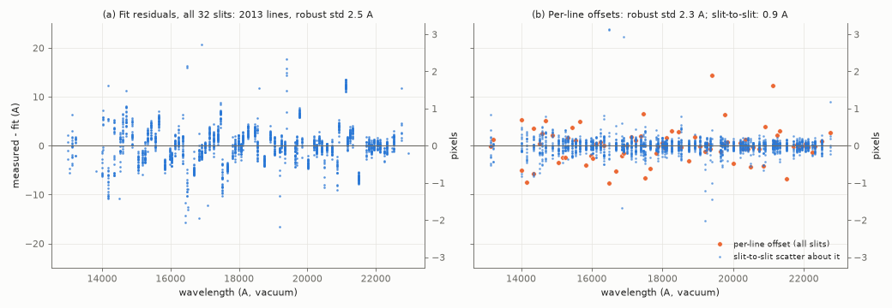

*Figure 5.  (a) Residuals of all 2013 fitted lines in the 32 slits.
(b) The same residuals split into an offset per line, shared by all
slits (orange), and the slit-to-slit scatter about it (blue).*

Accuracy:

- **Per-line offsets.**  Most of the 2.5 Å residual scatter is an offset
  for each line that every slit shares (2.3 Å robust std, 79 lines seen
  in ≥5 slits).  The likely cause is blends of OH lines at R ≈ 500,
  which shift the effective line centre away from the line-list value.
  This affects the absolute calibration at the ~0.3 px level.  It cannot
  be removed without a blend-aware (lower-resolution) OH line list.
- **Slit-to-slit precision.**  After removing those offsets, the
  slit-to-slit scatter is **0.9 Å (0.12 px)**.  This is the relative
  wavelength precision across the mask.
- **Isolated-line check.**  Only 3 OH lines are truly isolated at this
  resolution.  Measured directly in each slit's sky spectrum (31
  measurements), they sit +0.9 ± 0.5 Å from their line-list values,
  i.e. 0.12 px, or about 13 km/s.
- **Usable range.**  The sky emission covers 1.3–2.3 µm.  The solutions
  extrapolate outside that range.

### Tilts

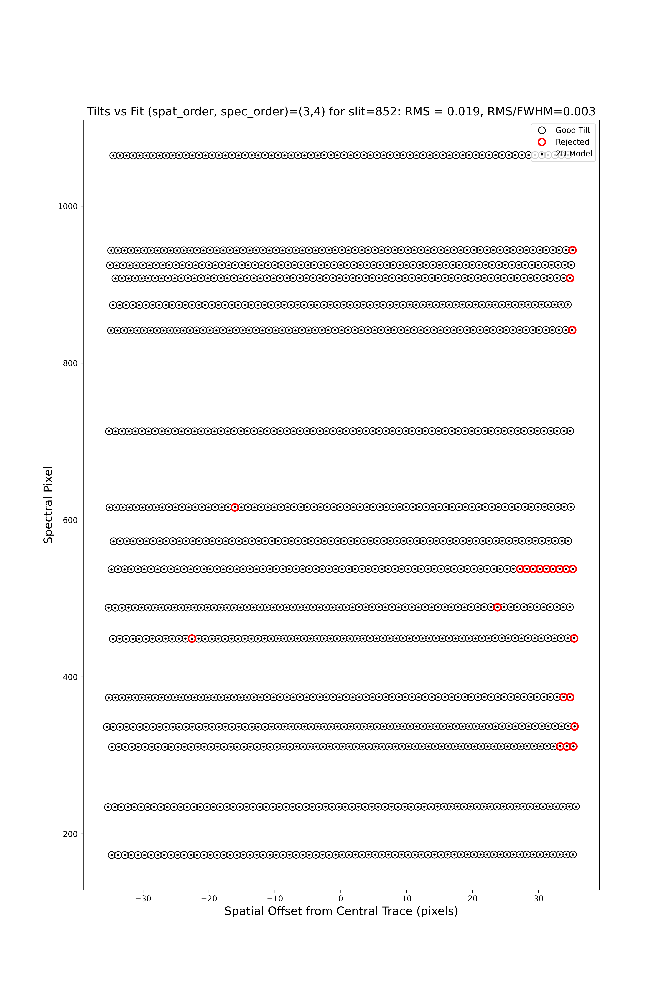

*Figure 6.  Tilt fit for slit 852: RMS 0.019 px (0.003 FWHM).*

The OH lines in each slit trace the tilts well.  Only a few points at
the slit ends are rejected.

### Flat field

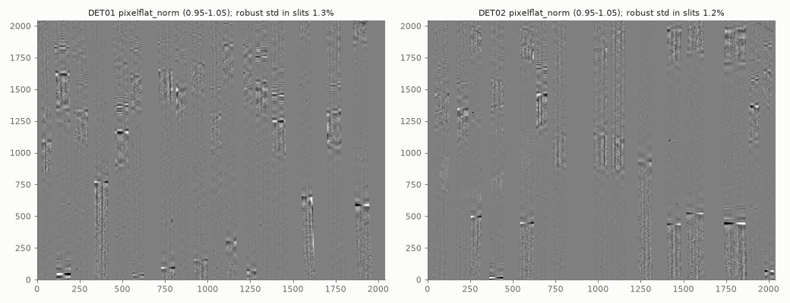

*Figure 7.  Normalized pixel flat (display range 0.95–1.05).*

The pixel-to-pixel scatter inside the slits is **1.2–1.3%**, as
expected.  There are two artefacts:

- **Bright/dark spikes (±5%)** where each slit's spectral coverage
  starts or ends.  Those are the places where the dome-lamp
  illumination drops off.
- **Horizontal striping** within some slits.  This is spectral
  structure that the spectral normalization did not fully remove.

Both are likely to leave residuals in the extracted spectra at the ends
of each slit's coverage (see [Concerns](#concerns)).

### Sky subtraction

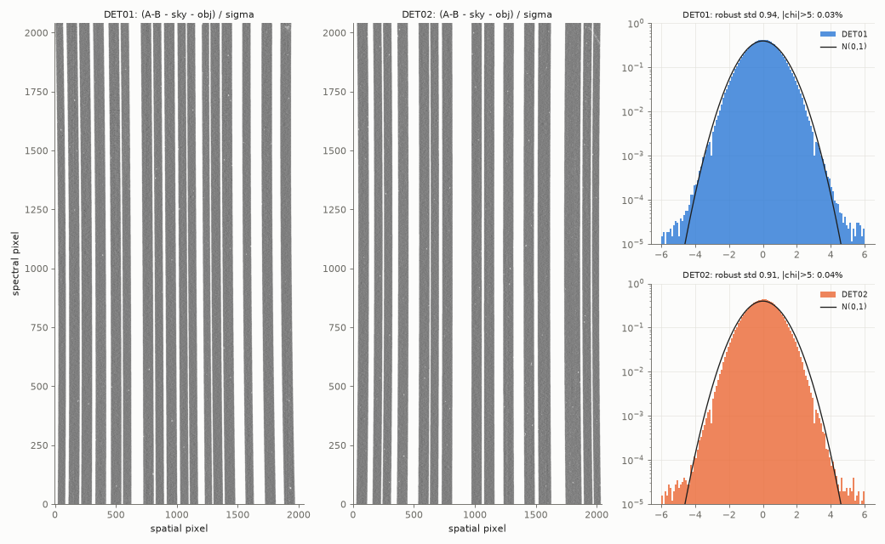

*Figure 8.  Residuals (A−B − sky − object)/σ for exposure 323, and their
histograms against N(0,1).*

- The residuals have no structure at the OH lines.  The median χ is 0.00.
- Only 0.03–0.04% of pixels have \|χ\| > 5; they are mostly cosmic rays
  and hot pixels.
- The robust std of χ is **0.91–0.94**, i.e. the noise model
  overestimates the noise by ~7%.  This fits the provisional gain and
  read-noise values, which assume NDR = 10 and are still to be confirmed
  by the instrument scientist.

### Objects and extraction

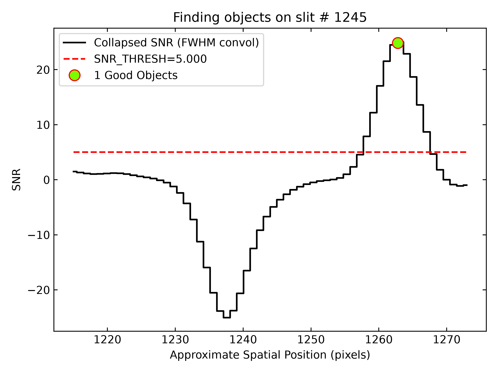

*Figure 9a.  Object finding in slit 1245 (DET01, exposure 323): the
positive A trace and the negative B trace are 26 px (3″) apart.*

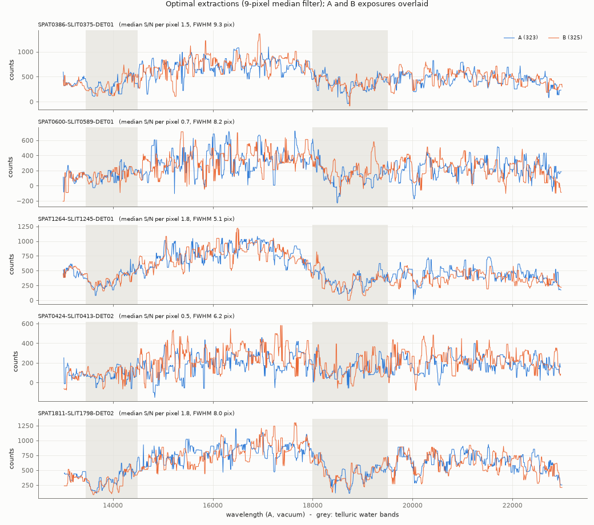

*Figure 9b.  Optimal extractions of the five objects, with the A (323)
and B (325) exposures overlaid.  Not flux calibrated.*

With `snr_thresh = 5`, each exposure gives 5 objects: 3 on DET01 and 2
on DET02.  The default threshold of 10 found only 2.

- The same objects are found in A and B, at offsets of 25–27 px,
  consistent with the 3″ dither.
- The A and B spectra agree in continuum shape and in the telluric water
  bands.
- The targets are faint: median S/N 0.5–1.8 per pixel in 180 s, and
  spatial FWHM 5–9 px (0.6–1.1″).
- Most science slits show no detected object in a single 180 s pair.
  These may need coadding (e.g. `pypeit_coadd_2dspec`) or manual
  extraction.

### Bad-pixel mask

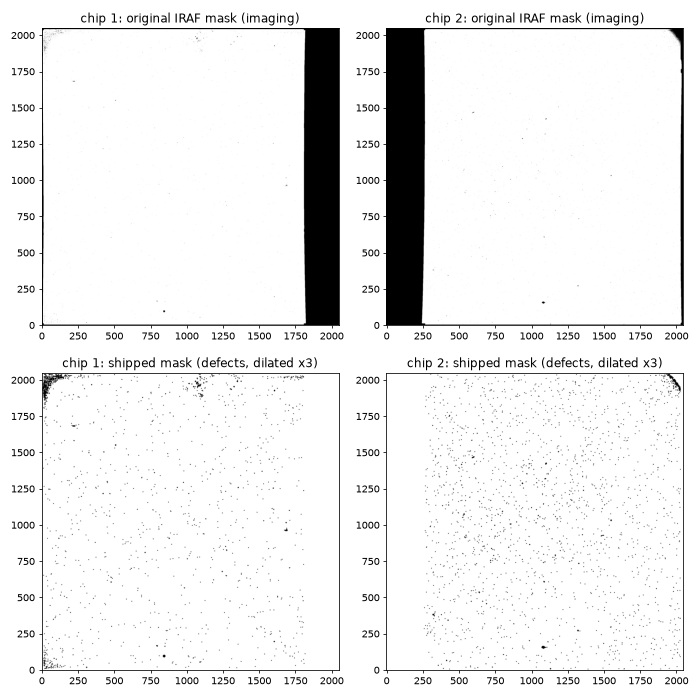

*Figure 10.  Top: the original NAOJ imaging masks, where the dark strips
are the beam-splitter shadow.  Bottom: the masks shipped with PypeIt,
holding only the isolated defects (dilated here for visibility).*

About 0.07% of the pixels on each detector are masked (~3000 per chip).
Of the masked pixels, 86–90% are outliers in the raw flats, compared
with <1% for a random mask.

## Concerns

1. **Flat-field artefacts** at the edges of each slit's spectral
   coverage (Figure 7).  Options:
   - mask those regions;
   - adjust the flat's spectral normalization (e.g. the
     `[calibrations][flatfield]` spectral b-spline settings);
   - accept them as edge effects.
2. **Possible second-order light beyond 2.3 µm.**  In Figure 4 (left),
   there is emission at pixels ~1500–2040 of slit 852, past the 2.3 µm
   cut-off.  On the extrapolated scale this is 2.4–2.9 µm, and doubling
   the J-band OH (1.2–1.45 µm) lands there.  The extractions shown stop
   at 2.3 µm, but slits that are shifted to the blue on the detector
   could include it.  To confirm with the instrument scientist (it may
   be a filter leak).
3. **The wavelength archive is self-referential.**  It was built from
   this same mask, so its performance on a different HK500 mask has not
   been shown yet.
4. **Absolute wavelengths** carry ~2 Å per-line systematics from blends
   (Figure 5b).  A blend-aware OH list for R ~ 500 would improve this.
5. **Noise model** is ~7% too high (Figure 8).  This should be revisited
   once the gain and read noise are confirmed.

## Still open for the instrument scientist

- gain, read noise (and whether it scales with NDR/`DET-NSMP`), dark
  current, and per-chip saturation/non-linearity;
- the mask-design file for `MO17A_COSMOS2` (object names and positions
  per slit);
- whether MOIRCS masks allow science slits to overlap in the spatial
  direction;
- the sign convention of the `K_DITCNT` offset, and other `K_DITPAT`
  patterns;
- the HK500 cut-off at ~2.3 µm, and the light beyond it (concern 2).

## Not yet tested

- Fluxing and telluric correction: there is no standard star in the
  dev-suite data.
- Coadding.
- Other grisms: the LS_J and LS_H data with ThAr arcs described in
  [`README`](README) are not yet in `RAW_DATA`.  Their arcs
  (`DATA-TYP = COMPARISON`?) will need frame typing.

## Reproducing

```console
pypeit_setup -s subaru_moircs -r $PYPEIT_DEV/RAW_DATA/subaru_moircs/HK500 -b -c A
cd subaru_moircs_A && run_pypeit subaru_moircs_A.pypeit -o
python make_report_figs.py   # from pypeitdev/subaru_moircs; uses run2/
```

The reduction used for this report is in `run2/subaru_moircs_A`.
