# Subaru/MOIRCS `VB_K` in PypeIt: development and reduction quality

Report on adding the MOIRCS `VB_K` grism (MOS mode) to PypeIt, tested
on one mask observed on 2026-05-29. It uses two example data sets from
that night: a **minimum** set (one A-B pair with all calibrations, to
share with the team) and the **full night** (32 science frames). It
summarizes the development log in `subaru_moircs_mo_vbk.md`
(Implementations #1-#11 and the full-night work). Figures are in
`report_vbk/`; `make_report_vbk.py` regenerates the ones made from the
reductions and copies the others from the check scripts.

## Summary

Minimum set (sections 3 and 4):

- **Reduction.** All 14 science slits on each detector are traced,
  flat-fielded, wavelength-calibrated and sky-subtracted with the MOIRCS
  defaults. `pypeit_setup` on the data directory gives a PypeIt file
  that needs no hand edits.
- **Wavelengths.** OH lines with `reidentify` against a new 28-slit
  archive (1.90-2.54 um). The rms is 0.06-0.24 px (median 0.16 / 0.12 px
  on DET01 / DET02, at 1.94 A/px). The ThAr arcs agree to ~0.1 px per
  slit once a flexure shift is removed. The mask image agrees to the
  ~1 px limit set by the field distortion.
- **Sky.** Residuals are at the noise level: chi robust std 0.92, and
  |chi| > 5 in 0.03-0.06% of the pixels. Nothing extra appears above
  2.3 um (thermal) or on the OH lines.
- **Fluxing.** A chip-1 sensitivity function is spliced from standards in
  two slits. It has a 0.14 mag step where the two standards meet,
  because PypeIt's normalized pixel flat leaves each slit's throughput in
  the counts. The zeropoint is 18.3-18.55 mag over 1.95-2.45 um.
- **Chip 2.** It has no standard. Its dome flats and night sky are
  21-25% brighter than chip 1's, so applying the chip-1 sensitivity
  function makes chip-2 fluxes ~21-25% too bright. A flat-ratio transfer
  (F2/F1 = 1.21 +- 3%) or a constant scale corrects this. Both are
  experimental; the default is for the team and the instrument scientist
  to decide (see the integration proposal).

Full night (section 5):

- **Drift.** The slit drifts along the slit by up to +/- 2 px over the
  two hours, which the header dither offsets do not record. The frames
  are aligned on the DET01 continuum target, detected in every frame at
  S/N ~1; DET02, with no bright object, uses the same offsets.
- **2D coadd.** The target reaches S/N 5.7 (one A-B pair: 1.4).
- **Emission lines.** Five slits show a single line each at
  23070-23116 A (S/N 4.7-8.8), where the sky has no line. If Halpha:
  z = 2.514-2.521; if [O III] 5008: z = 3.606-3.616.

Main caveats: the archive is built from the same mask it was tested on;
frames at other pointings (standards, arcs) are offset by ~1 px from the
science frames; the noise model gives chi < 1; the detector values are
still to be confirmed.

## 1. Data

Mask `MO_CC0958PA200_1`, `VB_K` grism, both detectors (raw files
`MCSA*.fits`, multi-HDU), all taken on 2026-05-29. The two example sets
are flat directories (no subdirectories), like the dev-suite
`RAW_DATA/<instrument>/<setup>/` directories. The calibration files of
the full-night set are hard links to the same files as in the minimum
set.

| set | directory (`test_data_moircs/VB_K/`) | files (chips 1 + 2) | size | use |
|---|---|---|---|---|
| minimum | `MO_CC0958PA200_1_minimum/` | 50 | 3.0 GB | to share; development and reduction quality |
| full night | `MO_CC0958PA200_1_20260529/` | 110 | 15 GB | 2D coadd and emission lines |

| frames | minimum | full night | exposure | `DET-NSMP` | PypeIt type |
|---|---|---|---|---|---|
| lamp-on dome flats | 7 | 7 | 7 s | 1 | `pixelflat,illumflat,trace` |
| lamp-off dome flats | 7 | 7 | 7 s | 1 | `lampoffflats` |
| science (A-B pairs) | 2 | 32 | 180 s | 10 | `arc,science,tilt` |
| standard HIP59174, set 1 (A-B) | 2 | 2 | 15 s | 1 | `standard` |
| standard HIP59174, set 2 (A-B) | 2 | 2 | 15 s | 1 | `standard` |
| ThAr arcs (evening) | 4 | 4 | 3 s | 1 | untyped (rows commented out) |
| mask image | 1 | 1 | 5 s | 1 | untyped (own setup) |

The minimum set's science pair (frames 031/033, 06:03-06:07 UT) is the
first pair of the night. The full night has 16 pairs from 06:03 to
08:02 UT (airmass 1.25-2.23), with dither widths cycling through 3.1,
3.0 and 2.9"; frames 067-075 are not included.

Each set is reduced with

```
pypeit_setup -s subaru_moircs -r <set directory> -b -c A
run_pypeit subaru_moircs_A/subaru_moircs_A.pypeit
```

The PypeIt file needs no edits: the ThAr rows are written commented out,
and the mask image forms its own setup (not written with `-c A`).

`VB_K` (nominally 1.8-2.5 um, 1.94 A/px) disperses past the detector
edges, so each slit sees about 0.4 um, set by its position in the mask.
The standard was observed in two slits so that the two sets together
cover the band.

## 2. Development

All PypeIt changes are in `pypeit/spectrographs/subaru_moircs.py`,
`pypeit/tests/test_subaru_moircs.py` and the new archive
`pypeit/data/arc_lines/reid_arxiv/subaru_moircs_VB_K.fits`. They come on
top of the HK500 work, and HK500 behaviour is unchanged except for the
instrument-wide items marked below.

| PypeIt commit | change |
|---|---|
| `e05792172` | standards with `DATA-TYP = STANDARD_STAR` typed by exposure time (<= 20 s); ThAr arcs and mask images left untyped; read noise 17.5/sqrt(`DET-NSMP`) e- (instrument-wide) |
| `deeac235c` | VB_K: `OH_MOSFIRE_K`, `fwhm = 6` |
| `d9e07e884` | VB_K: `maxnumber_std = 1` (one object per slit in standard frames) |
| `59ce81111` | VB_K: `reidentify` with `subaru_moircs_VB_K.fits`, `match_toler = 0.75` |
| `13edd3533` | IR sensfunc with the PCA telluric model (instrument-wide; the old TelFit default could not run) |
| `c08189b76` | unit tests (typing, read noise, `MCSA` files, pairing, grism parameters) |
| `33f81e0ba` | review fixes (dither offset, explicit `teltype`, rounded read noise, lighter tests) |
| `d25588cfb` | dither offsets (`dithoff`) in PypeIt's convention for 2D coadds: A = -`K_DITWID`/2, B = +`K_DITWID`/2 (instrument-wide; section 5.4) |

The unit tests (`test_subaru_moircs.py`, 18 tests) pass, as do
`test_spectrographs.py` and `test_metadata.py` (37 in all). Doc and
release-note drafts are in `docs/` (Implementation #9). PypeIt's doc
files and core code were not changed. Problems found in the core code
are listed in section 6.

## 3. Reduction quality: minimum set

The numbers and figures in this section come from the development
reduction `run5`. A rerun from the minimum data directory with the
current code (`minimum/subaru_moircs_A/`) reproduces it: the slit edges,
tilts and wavelength solutions are identical, the flats differ by
< 1e-7 (relative), the same objects are found in every frame, and the
extracted counts agree to within 0.22 sigma per pixel for the standard
star (relative difference <= 2e-3) and to 1e-7 for the other objects.
Only the `dithoff` values differ, by their sign (section 5.4).

### 3.1 Slits

19 slits are traced on each detector: 14 science slits and 5
alignment-star boxes, one-to-one with the apertures in the mask image.
No slit is missed or split, and the boxes are flagged `BOXSLIT`.

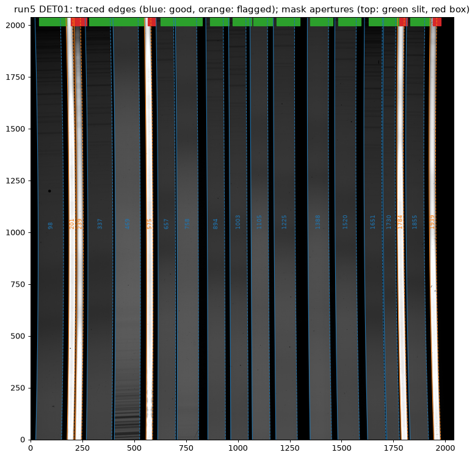

*DET01 lamp-on flat with the traced edges (blue: science slits; orange:
boxes) and the mask-image apertures (top bar). DET02:
`report_vbk/slits_DET02.png`.*

The lamp-on flats saturate in the boxes (67% / 80% of box pixels above
3.3e4 ADU on DET01 / DET02). Outside the boxes, only ~15 pixels
saturate, in one science slit next to a box (DET01 slit 98). The tracing
is not affected. The traced slits are 4-6 px narrower than
the apertures in the mask image.

### 3.2 Flat field and bad pixels

- Pixel flat (central 80% of each science slit): scatter 0.80%
  (DET01) and 0.69% (DET02). The median along each spectral row is
  0.998-1.003. Unlike `HK500`, there are no +-5% artefacts at the ends
  of the spectra, since `VB_K` spectra fill the chip.
- The lamp-off flats are subtracted from the lamp-on flats, which removes
  the thermal emission through the slits.
- The 2016 bad-pixel mask still matches where it masks: 89% / 96% of the
  masked pixels are outliers in the 2026 flats, against 1-3% for
  flipped copies. About 720-760 persistent defects per chip (~0.02% of
  pixels) are not in it. They mostly cancel in A-B frames.

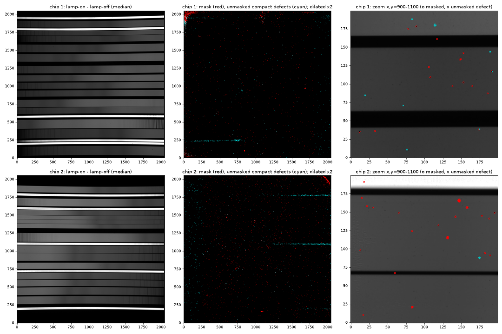

### 3.3 Wavelength calibration

Setup: `reidentify` against `subaru_moircs_VB_K.fits` (the 28
holy-grail solutions of this mask), `OH_MOSFIRE_K`,
`match_toler = 0.75 px`.

| | DET01 | DET02 |
|---|---|---|
| science slits solved | 14/14 | 14/14 |
| rms (px), range (median) | 0.064-0.236 (0.159) | 0.085-0.190 (0.116) |
| lines fitted (kept) | 41-56 (35-51) | 47-55 (42-49) |
| solution range | 1.901-2.544 um | 1.914-2.530 um |

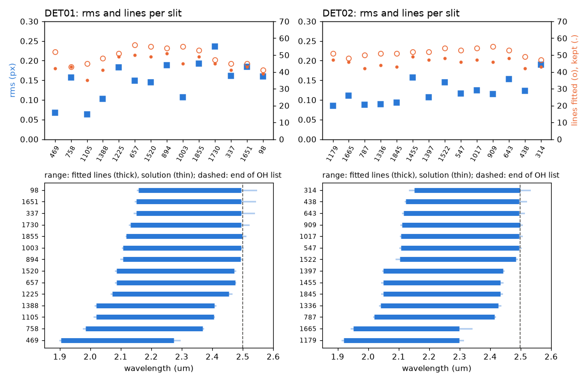

*Top: rms (squares) and number of lines (circles: fitted; dots: kept) per
slit. Bottom: wavelength range of each slit. The OH lists end at
2.499 um (dashed), so the red ends of the reddest slits are extrapolated
(up to ~250 px). The dome-flat signal falls to 50% at ~2.47 um, so this
region has little light.*

How the archive was chosen and tested (Implementation #5):

- Each solution agrees with the holy-grail solution it replaces to
  <= 0.12 A.
- The archive is **self-referential**. As independent proxies, every
  slit was reidentified against the archive without itself
  (leave-one-out) and against the other chip's slits only. With the
  default `match_toler` (2 px), one slit failed both tests: it was off by
  up to 35 A at its red end, yet its rms (0.36 px) looked normal. With
  0.75 px, all 28 pass both tests (max error 1.3 A).
- A second `VB_K` mask is needed for a real test.

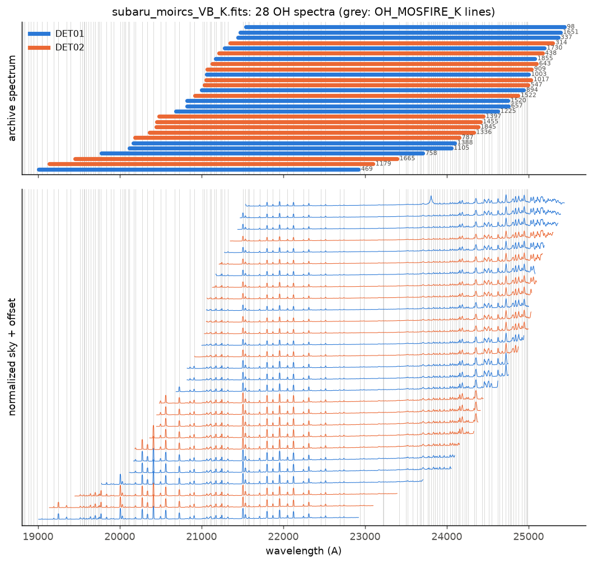

While tuning holy-grail, a PypeIt bug was found: the quadrangle pattern
search stores dispersions as unsigned integers. For 15 of the 28 slits
the stored rms is ~2x too large. A fix and a bug report for the team
exist (Implementation #5; patch in `patches/`). VB_K is not affected
while it uses `reidentify`.

### 3.4 Independent wavelength checks

**ThAr arcs** (evening, same mask; Implementation #6). The 25
`Ar_IR_MOSFIRE` lines in 1.8-2.5 um were placed with the OH solution and
measured in the arc spectrum of each slit:

- Every science slit has 4-11 Ar lines (95 and 97 lines on DET01 /
  DET02).
- Within a slit, the offsets do not change with wavelength (<= 0.04 px
  per 1000 A), so the shape of each OH solution is right.
- The offsets are a shift plus a rotation across the chip (chip medians
  -0.81 / +0.40 px). Once that is removed, each slit agrees to 0.11 /
  0.08 px rms.
- The standards' own OH lines show the same pattern against the science
  solution (Implementation #4). So frames taken at other pointings are
  displaced by up to ~1 px, which is flexure, not a calibration error.

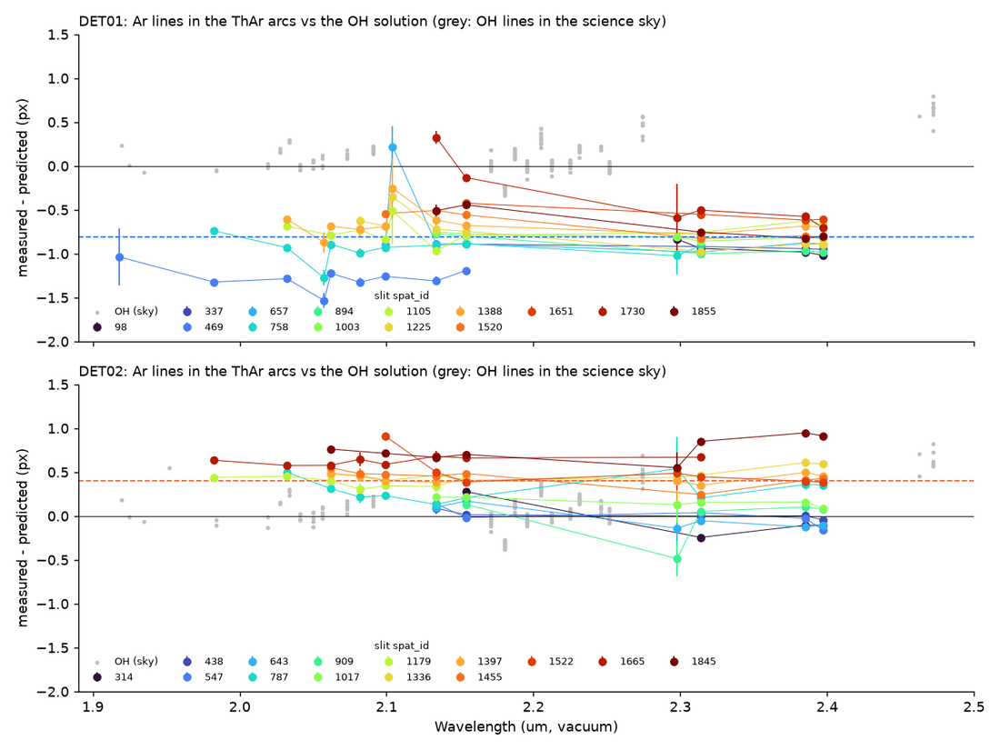

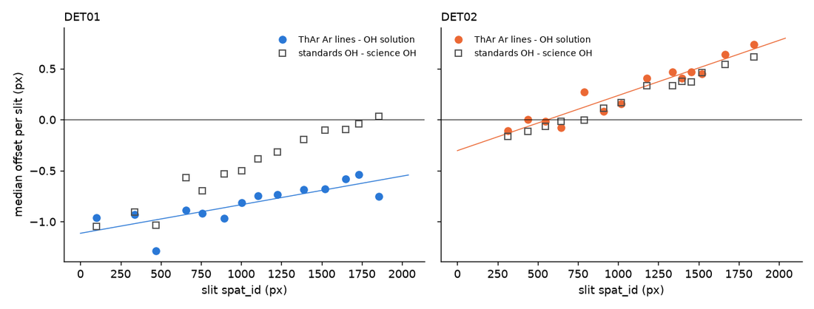

*Per-slit offsets against the slit position: ThAr minus OH solution
(filled) and the standards' OH minus the science OH (open). Both show
the same shift plus rotation.*

The ThAr frames must be combined **without** sigma clipping. The lamp
lights a different part of the mask in each frame, so the default
clipped combine rejects the bright frames on the lines and moves line
centroids by up to 2.7 px. A user who types the arcs by hand needs
`[calibrations][arcframe][process] clip = False` (in the doc draft).

**Mask image** (Implementation #6). At a fixed detector row, the
wavelength changes with the slit's row in the mask by -1.96 to -1.97 A
per mask pixel, as expected. With a quadratic field term, the slits
follow the model to 1.19 px (DET01) and 0.65 px (DET02) rms. No slit is
flagged. This check is sensitive to errors >~ 3 px, such as the
leave-one-out failure above.

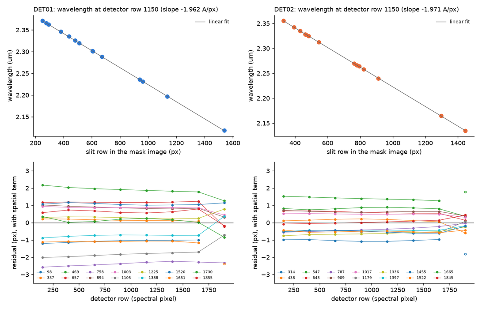

### 3.5 Tilts and sky subtraction

- Tilts: 19-33 OH lines per slit, fit rms 0.02-0.03 px.
- Science A-B: chi robust std 0.92 on both chips, with |chi| > 5 in
  0.034% (DET01) and 0.057% (DET02) of the pixels. Above 2.3 um
  (thermal): 0.88 / 0.86. On the bright OH lines: 0.80 / 0.78, with no
  excess of outliers. Column pattern (std of the per-column median of
  chi): 0.04-0.11, against ~0.025 for white noise.
- Chip-2 raw A-B frames show ~64-column bands from the detector
  readout channels. Each band covers a fixed wavelength across the whole
  slit, so the sky fit removes it.
- The single-read standards show bands along the dispersion direction.
  They leave column residuals of 0.09-0.12 sigma, and the object finder
  picks them up as faint "objects" (S/N < 1). The reference pixels
  cannot remove them.

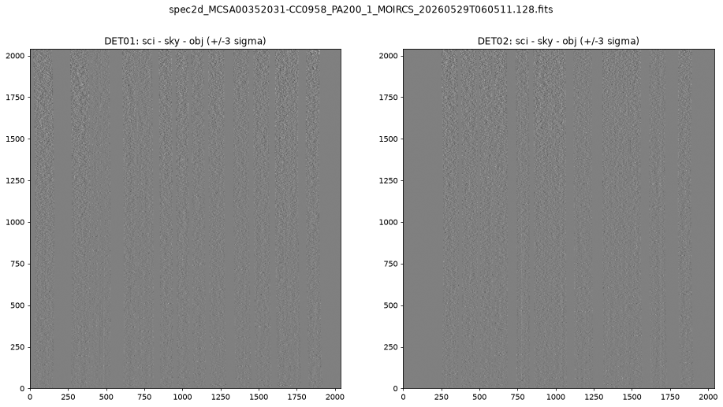

*Science frame A minus sky minus objects, +-3 sigma.*

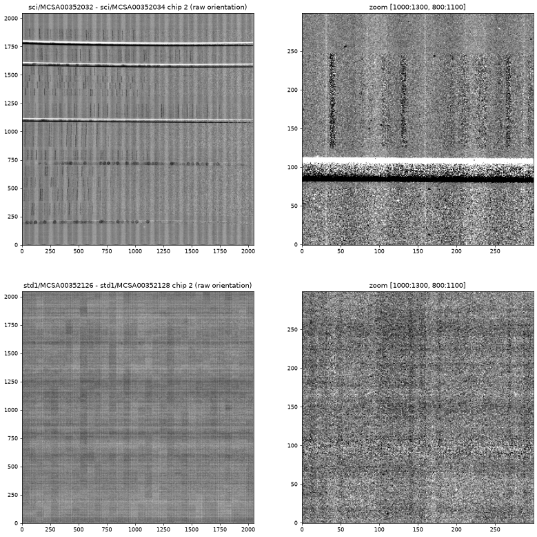

### 3.6 Objects

- Science: one target, DET01 slit 469, S/N 0.7-1.1 per pixel per frame.
  Nothing else is detected in the 180 s pair.
- Standards: the star is found on DET01 (set 1 in slit 337, 2.14-2.54
  um; set 2 in slit 469, 1.90-2.29 um), with S/N 200-226. Before
  `maxnumber_std = 1`, a sky-subtraction artefact at a slit edge had a
  higher S/N than the star in one frame and would have been chosen as
  the standard.

## 4. Fluxing: minimum set

### 4.1 Standard star and sensitivity function

HIP59174 is A2IV, V = 7.45, Ks = 7.36. The A and B frames of each set
were coadded unfluxed on equal-length linear grids; `pypeit_sensfunc`
cannot yet splice inputs of different lengths. The sensfunc uses the IR
algorithm with the PCA telluric model, the A0 (Vega) stellar template
and `star_mag` = V.

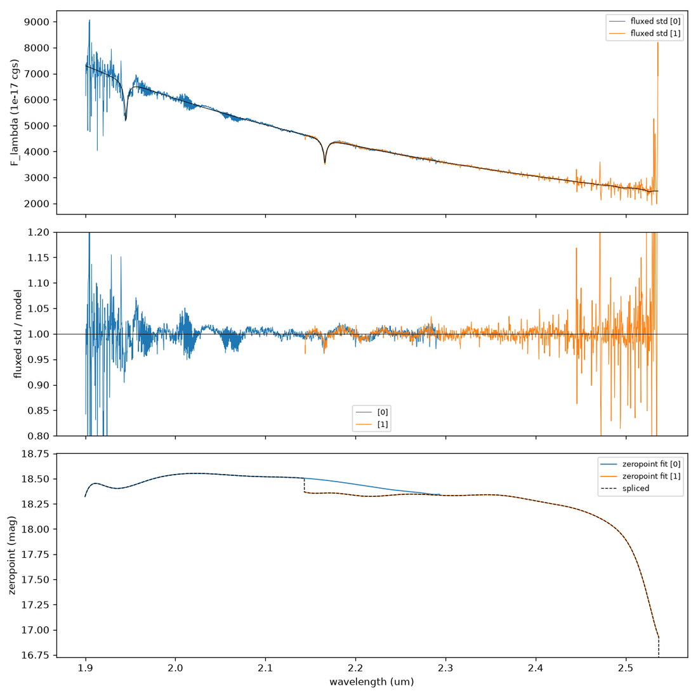

*Top: fluxed standards against the model. Middle: their ratio. Bottom:
the two zeropoints and the spliced one.*

- Residuals of the fluxed standards against the model (std): 0.7-0.8%
  where the telluric transmission is > 0.95. Where it is < 0.8: 5.6%
  (set 2) and 21% (set 1, low S/N above 2.45 um).
- Zeropoint 18.3-18.55 mag over 1.95-2.45 um (throughput 16-19%),
  falling to 17.9 at 2.50 um.
- **Splice step.** In the overlap (2.14-2.29 um) the two standards
  differ by 0.135 mag at the blue end and 0.016 mag at the red end. The
  splice switches standards at 2.143 um, which leaves a 0.14 mag step.
  The raw dome flat of the two slits explains all but <= 0.023 mag of the
  difference: set 1 sits at the chip edge, where its slit's throughput is
  ~10% lower. A relative slit-throughput correction from the raw flat
  would remove it; that would change the fluxing model, so it is open.
- Stellar model: A0 Vega scaled to V is 6.6% below the star's 2MASS Ks
  flux. The Kurucz A2 model is 2.8% above, but too coarse (Br-gamma
  residual -4.6%). The zeropoints differ by 0.12 mag.
- The standards use the science OH solution. Their own lines are offset
  by -0.9 to -1.2 px in the two star slits. The telluric fit absorbs a
  shift of this size at the blue end, but its offset grows to +2.5 px at
  the red end. The OH and ThAr checks show no such trend, so the cause is
  unknown.

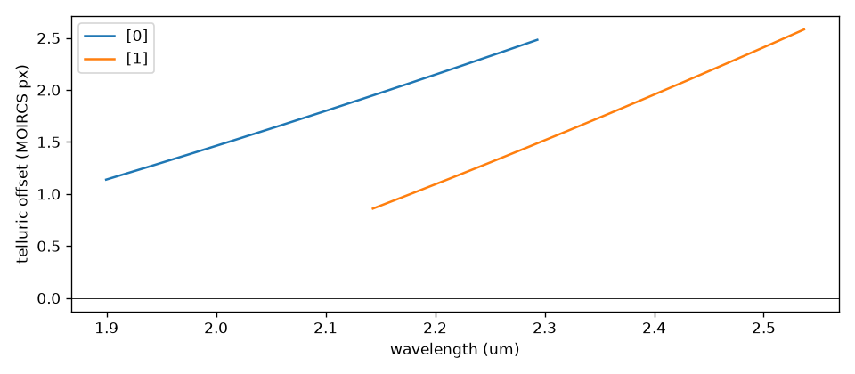

### 4.2 Chip 2: F2/F1 and the two fluxing modes

The raw (lamp-on minus lamp-off) dome flat of each science slit,
collapsed along the slit and converted to counts per Angstrom, gives
F2/F1:

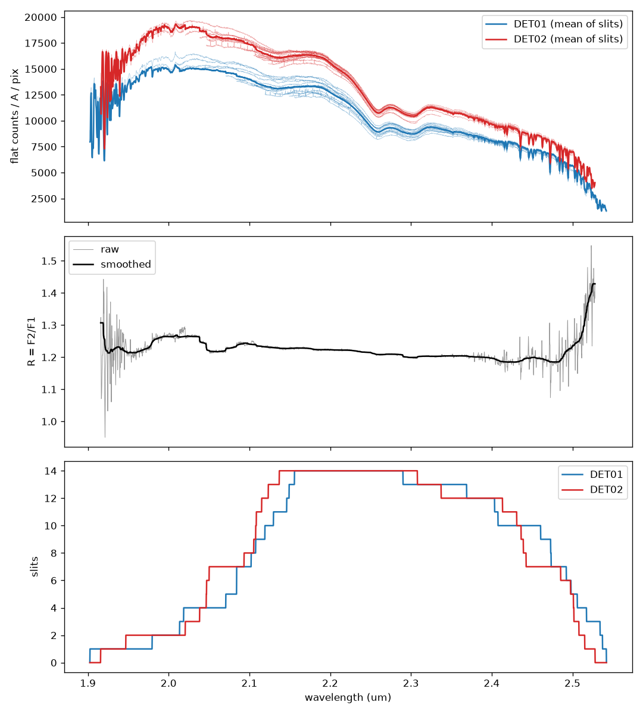

- R = F2/F1 = **1.21**, within +-3% over 1.95-2.50 um. Where >= 10
  slits per chip overlap (2.10-2.45 um) it is 1.20-1.23. It rises to
  1.43 above 2.50 um, where only 1-3 slits remain. R is defined over
  1.916-2.528 um.
- Night-sky check: S2/S1 = 1.25 (1.20-1.30). The sky-to-flat ratio is
  1.029 +- 0.011, so the shape of R agrees to ~1% but its level differs
  by 3%. Both channels see the sky at the same time, so the 3% is
  probably the dome screen lighting the two halves of the field
  differently.

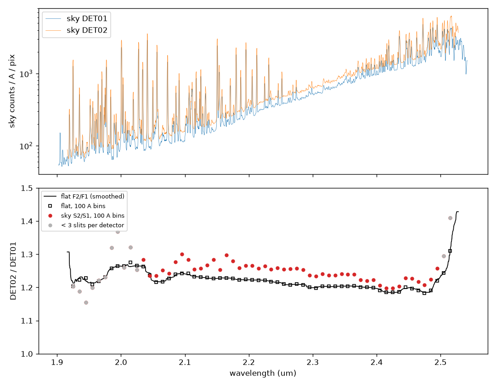

**Fluxing chip 2.** `pypeit_flux_calib` applies one sensitivity function
to every object in a spec1d file, whatever its detector. The workaround
tested here splits each spec1d file per detector (`transfer_sensfunc.py
split`) and gives each detector its own sens file:

- `direct`: the chip-1 zeropoint, optionally plus 2.5 log10(s);
- `flatratio`: the chip-1 zeropoint plus 2.5 log10 R(lambda), undefined
  (masked) where R is undefined.

`pypeit_flux_calib` and `pypeit_coadd_1dspec` accept the split files.
The science pair has no chip-2 object, so the comparison uses the sky
"objects" of a standard frame. The flatratio / direct flux ratio is 1/R
to machine precision (0.82; 0.70-0.84), and 23 pixels at the edges of R
are masked in flatratio mode:

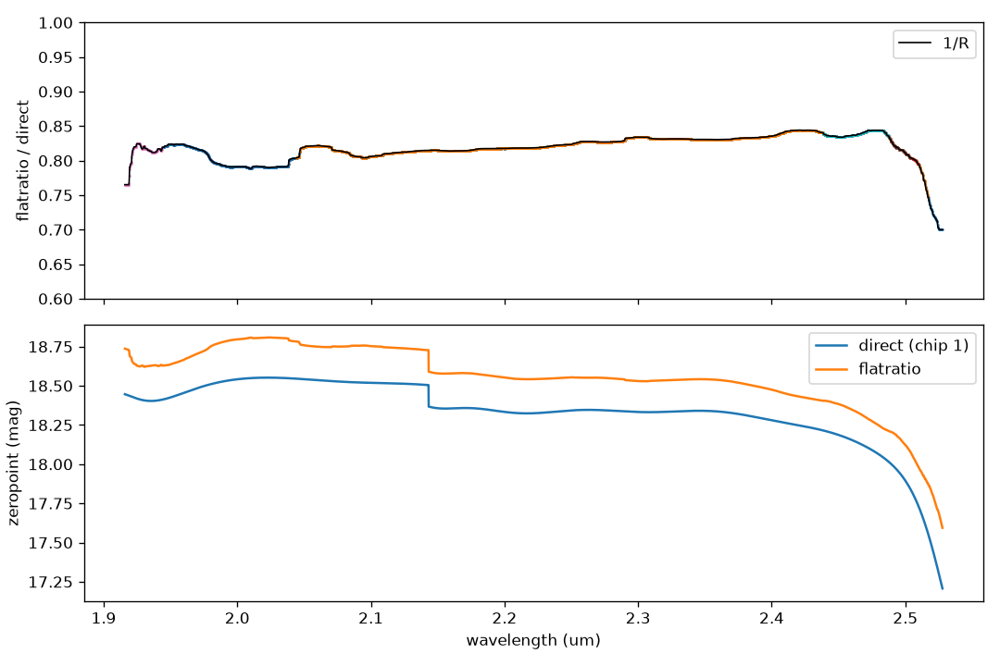

So for `VB_K`, a constant scale of 1.21 (flats) or 1.25 (sky) matches
the flat ratio to ~3%. Applying the chip-1 sensfunc unchanged (s = 1) is
21-25% off. **Not tested on a real chip-2 source.**

### 4.3 Noise model

chi is below 1 everywhere: 0.92 (science), 0.87 (single-read
standards), 0.78-0.80 on bright OH lines. The reference pixels give a
read noise of 11-14 e- for one sample and 5-6 e- for ten, against the
assumed 17.5 and 5.53 e-. The measured noise also does not scale as
1/sqrt(NSMP). The low chi on bright lines also points at the
photon-noise term (gain, or Fowler sampling). The detector values are
for the instrument scientist.

## 5. The full night: 2D coadd and emission lines

Work in `sci_all/` (the reduction was run before the full-night
directory existed, from the original subdirectories; the PypeIt file
written from `MO_CC0958PA200_1_20260529/`, in `night_20260529/`, has
the same science rows and adds the standards and the commented ThAr
rows).

### 5.1 Reduction

The 32 science frames and the dome flats were reduced with the MOIRCS
defaults (one `run_pypeit` per detector). The OH arc is now the
combination of the 32 frames: 14/14 slits per chip with median rms 0.112
/ 0.113 px (DET01 / DET02; minimum set 0.159 / 0.116), and every solution
agrees with the minimum set's to <= 1.1 A.

### 5.2 Drift and alignment on the target

The continuum target in DET01 slit 469 is detected in all 32 frames
(S/N 0.5-1.2 per frame). Its position along the slit drifts by up to
+/- 2 px over the two hours, with A and B frames moving together. The
header dither offsets do not record this: between 06:45 and 07:05 UT
they are off by up to 2.8 px, about half the width of the target's
profile (FWHM 5-6 px).

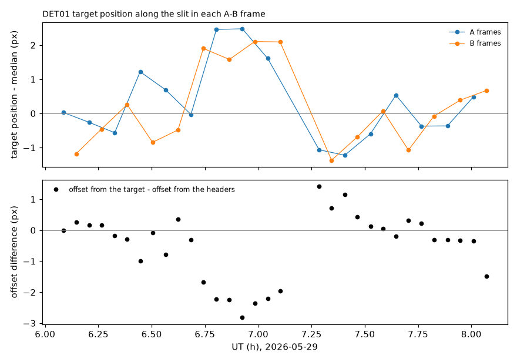

*Top: target position in each frame, relative to the median for A (blue)
and B (orange) frames. Bottom: coadd offset measured on the target minus
the offset from the header dither cards.*

The 2D coadd (`pypeit_coadd_2dspec`) therefore aligns the frames on the
target:

- DET01: `offsets = auto` with the target named in each frame
  (`user_obj_ids`). PypeIt then also requires `weights = auto`, which
  gives constant weights from the target's S/N (0.27-1.60; the last,
  high-airmass frames weigh least).
- DET02 has no bright object. It uses the DET01 offsets and weights as
  lists, on the assumption that both detectors move together
  (`make_coadd2d_bright.py`).

| | header offsets, uniform weights | target offsets and weights |
|---|---|---|
| DET01 target, continuum S/N | 5.33 | 5.73 |
| DET01 lines (23097, 23070, 23266 A) | 8.9, 6.8, 5.3 | 8.8, 6.7, 5.0 |
| DET02 lines (23075, 23111, 23116, 20703 A) | 7.1, 6.3, 5.2, 5.6 | 6.1, 6.0, 4.7, 6.7 |

The target gains 7% (one A-B pair: S/N 1.41; x sqrt(16) would be 5.6).
The line S/N values change by about +/- 1 either way, within their own
uncertainty, so these data cannot confirm or rule out that DET02 shares
the DET01 offsets, and the change of weights is mixed in.

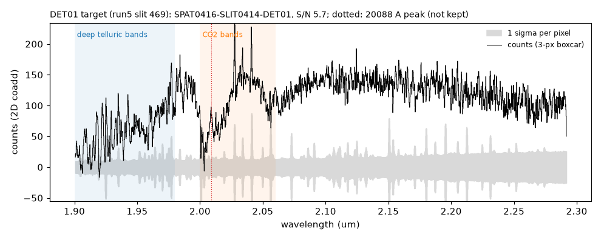

*The coadded target (counts, not fluxed, no telluric correction).*

### 5.3 Emission lines

Search (`find_emission_lines.py`): the continuum is removed with a 51-px
running median along the spectrum; a matched filter (Gaussian, sigma 2.5
px) gives an S/N map; peaks with S/N > 5 are kept if their negative
images (+/- 26 px) are present and no sky line lies within 8 A. The sky
lines come from the OH spectra of the night's own wavelength
calibration. Of 34 peaks, the visual check keeps these (run5 slit
numbers; vacuum wavelengths, no heliocentric correction):

| detector | slit | lambda (A) | S/N | z (Halpha) | z ([O III] 5008) | note |
|---|---|---|---|---|---|---|
| DET01 | 1855 | 23097.4 | 8.8 | 2.5185 | 3.6119 | 2.31 um group |
| DET01 | 1003 | 23069.9 | 6.7 | 2.5143 | 3.6064 | 2.31 um group |
| DET02 | 314 | 23073.2 | 6.1 | 2.5148 | 3.6070 | 2.31 um group |
| DET02 | 787 | 23111.2 | 6.0 | 2.5206 | 3.6146 | 2.31 um group |
| DET02 | 1017 | 23115.6 | 4.7 | 2.5212 | 3.6155 | 2.31 um group; below the threshold here (5.2 with header offsets) |
| DET02 | 1179 | 20704.1 | 6.7 | 2.1539 | 3.1340 | uncertain: negative images stronger than the line |
| DET01 | 98 | 23265.5 | 5.0 | 2.5441 | 3.6454 | single |

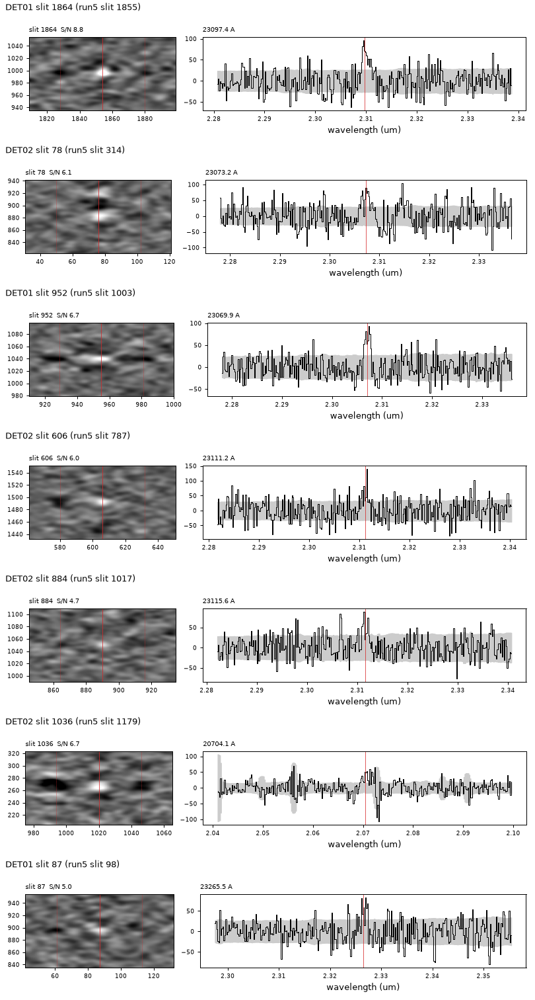

*Matched-filter S/N stamps (left; dotted: expected negative images) and
boxcar spectra (right) of the candidates.*

**The 2.31 um group.** Five slits, one line each, spanning 46 A (593
km/s; rms 245 km/s around 23094 A). The OH spectra of all slits have no
sky line between 23000 and 23200 A, even at 3 sigma. A sky residual
would also appear along the full length of every slit; averaged over
each slit with the candidates masked, the S/N near these wavelengths
stays within +/- 0.5 in every slit. So these look like five sources at
nearly the same redshift. No second line ([N II], [S II], or [O III] 4960
and Hbeta) is seen at this S/N; which interpretation applies depends on
how the mask targets were selected.

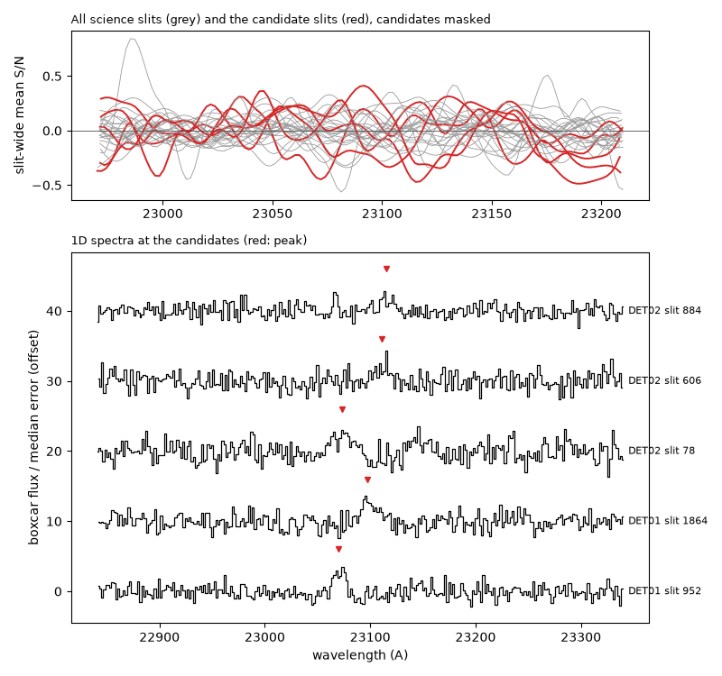

Rejected: peaks within 8 A of sky lines (24184, 24354, 24620, 24722-24728
A); a run of peaks in the target slit at 1.90-1.98 um and one at 20088 A
(the target's continuum through the water and CO2 telluric bands); one
at the target slit's end; striping at a slit edge (run5 slit 1520,
22673 A); sky-line residuals (DET02 slit 1179, 20367 A); two thermal-
region peaks next to the 24724 A sky line.

A summary page with the same content:
https://claude.ai/artifact/1Sfg6Y2thrkYrfspneJ3jy.

### 5.4 Header offsets and the `dithoff` sign

PypeIt can also align frames with the dither offsets in the headers
(`offsets = header`). PypeIt's `dithoff` is the offset of the slit with
respect to the object, so an object moves by -`dithoff` along the
spatial axis. The object sits 27 px higher in A than in B, so A =
-`K_DITWID`/2 and B = +`K_DITWID`/2. `subaru_moircs.py` had the opposite
sign, which made the coadd stack the negative traces; it is now fixed.
The direction was checked on both detectors (alignment-box stars) and at
two position angles (standards at 90 deg, science at 200 deg), and the
header WCS predicts the same direction. Spectra reduced before the fix
keep the old sign in their headers until the PypeIt file is regenerated
with `pypeit_setup` and the science frames are reduced again.

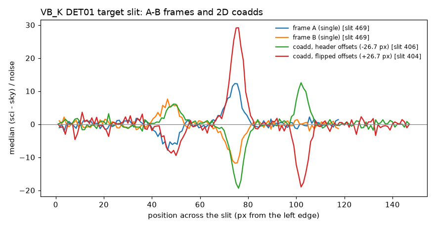

*One A-B pair, target slit, spatial profile collapsed along the
spectrum. With the corrected sign (red) the positive traces add up;
with the old sign (green) the negative ones do.*

Header offsets cannot follow the drift in 5.2, so a bright object in one
slit is the better reference whenever there is one.

## 6. Open issues

For the instrument scientist:

- Detector values and the noise model (section 4.3).
- Flexure of ~1 px between pointings (a shift plus 0.3-0.6 px per
  1000 px of rotation), and the +/- 2 px drift along the slit during the
  science sequence (section 5.2). Are they known? Should standards get
  their own calibration group? The PypeIt-file recipe is in the doc
  draft; it is untested.
- Flats saturating in the alignment boxes; a refreshed bad-pixel mask.
- Standard-star strategy for `VB_K` (two slits, the splice step), and the
  stellar template (A0 vs A2).
- The chip-2 transfer default (with the team).
- Mask-design files (objects are not matched to targets); touching slits.

For the science (full night):

- Compare the 2.31 um group with the target catalogue to tell Halpha
  from [O III]; look for second lines in deeper data or a stack.
- The DET02 alignment assumes the DET01 offsets. A bright object on
  DET02 in future masks would test this; the effect of the weights can
  be separated by a coadd with the target offsets and uniform weights.
- Data from other nights: reduce each night with its own calibrations
  (separate PypeIt files, or calibration groups by hand; `pypeit_setup`
  puts all frames of one mask in one group), align each night on the
  target, then measure the shift between nights the same way.
- Telluric correction of the target before using 1.90-2.06 um.

For the PypeIt team:

- Apply the doc drafts (`docs/`) and run `build-docs`
  (`docs/generated_docs.md` lists the generated files that change).
- Review items settled by earlier decisions but worth revisiting:
  - `STANDARD_STAR` frames longer than 20 s are typed `science`;
  - short `OBJECT` standards (HK500 style) are also typed as arcs;
  - `maxnumber_std = 1` is VB_K-only;
  - A-B pairing does not check the target or the dither width.
- Core-code problems found along the way (not changed):
  - the holy-grail dispersion truncation (bug report and patch);
  - `SensFunc.unpack_std` fails on spliced inputs of different lengths;
  - two runs that first download a telluric grid at the same time race
    on moving the file (`io.load_telluric_grid`);
  - the splice takes the overlap from the redder spectrum's edge;
  - `pypeit_coadd_2dspec` accepts `user_obj_ids` only with
    `weights = auto`, so a reference object cannot set the offsets alone.
- A *K*-band Th line list for full ThAr solutions (`Ar_IR_MOSFIRE`
  21041.57 A looks blended).
- Validation:
  - a second `VB_K` mask, including slits below 1.90 um;
  - an HK500 regression run, including its `reidentify` `match_toler`;
  - dev-suite integration: the minimum set is laid out as a `RAW_DATA`
    directory and needs a `pypeit_files` entry.

For the HK500 developer (HK500 is developed separately):

- Since 2026-10-04, `dithoff` follows PypeIt's convention for 2D coadds
  (`offsets = header`): A = -`K_DITWID`/2, B = +`K_DITWID`/2 (it was the
  other way round). In the VB_K data the old sign stacked the negative
  traces instead of the positive ones. The A-B pairing (`comb_id`,
  `bkg_id`) does not change.
- The dev-suite file `pypeit_files/subaru_moircs_hk500.pypeit` still has
  the old values in its `dithoff` column (A 1.5, B -1.5), and so would
  any HK500 spec2d reduced from it. That matters only for 2D coadds with
  `offsets = header`; rerunning `pypeit_setup` (or flipping the column)
  fixes it. Not changed here.

## 7. Integration proposal

Only PypeIt code should be needed for reductions, so the chip-transfer
workaround (`transfer_sensfunc.py` here) should move into PypeIt. The
proposal has three independent parts. None of it is implemented. (A
MOIRCS-only alternative, with the transfer code in `subaru_moircs.py`,
is discussed in VB_K Q11 of the development log; it is pending with the
PypeIt core members.)

### (i) Per-detector sensitivity functions in fluxing (not MOIRCS-specific)

Today `SpecObjs.apply_flux_calib` (`specobjs.py` ~l.645-695) applies
column 0 of the sens file to every `MultiSlit` object. Its multi-column
branch is used only inside `sensfunc.py` for QA, and indexes by object,
not by detector. Proposal: let the flux file assign a sens file per
detector, e.g. an optional `det` column:

```
flux read
  filename         | sensfile             | det
  spec1d_A.fits    | sens_det1.fits       | DET01
  spec1d_A.fits    | sens_det2_xfer.fits  | DET02
flux end
```

Fluxing would then group the rows by spec1d file and apply each sens
file only to the objects with that `DET`. Rows without `det` keep
today's behaviour. This removes the spec1d-splitting workaround and also
serves any multi-detector spectrograph whose standard covers one
detector (e.g. a spectral mosaic where the standard falls on one chip).

- Files: `pypeit/inputfiles.py` (`FluxFile`: optional `det` column and
  its checks), `pypeit/fluxcalibrate.py` (`flux_calibrate`: one write per
  spec1d after all its detectors), `pypeit/specobjs.py`
  (`apply_flux_calib`: optional detector selection),
  `pypeit/scripts/flux_calib.py` (help text), `doc/fluxing.rst`,
  `doc/releases/<dev>.rst`. No datamodel change.
- Tests: `pypeit/tests/test_flux.py` or a new test. Build a synthetic
  two-detector `SpecObjs` and two synthetic `SensFunc` objects with
  different zeropoints, then check that each detector's objects get their
  own zeropoint, that rows without `det` keep today's behaviour, and that
  a missing detector is reported. Add a `FluxFile` parsing test with and
  without `det`. Dev suite: a `fluxing_files` entry for a MOIRCS setup.
- Evidence: without it, MOIRCS chip-2 fluxes are 21-25% off (section
  4.2). With split files, the mechanics already work through today's
  `pypeit_flux_calib` and `pypeit_coadd_1dspec`.

### (ii) A transfer script, e.g. `pypeit_sensfunc_transfer`

This builds the sens file for the other detector from the standard's
sens file and the calibration directory:

```
pypeit_sensfunc_transfer sens_std.fits Calibrations/ --from-det 1 --to-det 2 \
    --mode flatratio|direct [--scale s] -o sens_det2.fits
```

- Code: the functions of `transfer_sensfunc.py` (`slit_flat_spectra`,
  `average_flat_spectrum`, `flat_ratio`, `transfer_zeropoint`; QA plot)
  move into a new module, e.g. `pypeit/sensfunc_transfer.py`. They use
  `FlatImages`, `SlitTraceSet` and `WaveCalib`, so not `pypeit/core`. A
  thin script goes in `pypeit/scripts/sensfunc_transfer.py`.
  `split_spec1d_by_det` is not needed once (i) is in.
- Files: the new module and script, `pypeit/scripts/__init__.py` (script
  list), `pyproject.toml` (entry point), `doc/fluxing.rst` (new section),
  the generated script help (`write_script_help.py` via `build-docs`),
  `doc/releases/<dev>.rst`. The output is a normal `SensFunc` file with
  provenance cards (`SENSXFER`, `SENSFROM`, `SENSTO`, `SENSSRC`,
  `SENSSCL`); adding these as datamodel or header items needs a decision.
- Tests: unit tests with synthetic flats and slits:
  - a known R(lambda) is recovered;
  - R is undefined, and the zeropoint NaN, where only one detector has
    slits;
  - `direct` with s = 1 leaves the zeropoint unchanged, and with s adds
    2.5 log10(s);
  - both directions (1 -> 2 and 2 -> 1) work;
  - a parser test for the script.

  Dev suite: an afterburn test on the MOIRCS `VB_K` data once they are in
  `RAW_DATA`.
- Evidence: F2/F1 = 1.21 +- 3% over 1.95-2.50 um; the sky check (1.25,
  shape agrees to 1%); `transfer_sensfunc.py` reproduces its outputs
  exactly (Implementation #7).

### (iii) MOIRCS defaults, once the team picks a mode

- Options:
  - `flatratio` by default, which needs the run's `Calibrations/` at
    fluxing time;
  - `direct` with a per-grism constant (1.21 for `VB_K` from the flats,
    1.25 from the sky), which needs no calibration files;
  - documentation only, with no default.
- Files: `pypeit/spectrographs/subaru_moircs.py`. It could hold, for
  example, a per-grism transfer scale in `config_specific_par` or a small
  method read by (ii), which needs a hook in the base `Spectrograph`
  (`pypeit/spectrographs/spectrograph.py`) if more instruments use it.
  Also `doc/spectrographs/subaru_moircs.rst` and the release notes.
- Tests: `test_subaru_moircs.py` (the default mode and scale per grism).
  Dev suite: a `VB_K` setup in `test_setups.py` with `pypeit_files`,
  `sensfunc_files` and `fluxing_files` entries.
- Evidence needed first: a real chip-2 source (a standard on chip 2, or
  an object seen on both chips), and the same ratio measured on other
  grisms and nights. The 3% flat-vs-sky difference decides between the
  flat (dome illumination) and the sky (same light path as the science)
  as the reference.

## 8. Reproducing

In `pypeitdev/subaru_moircs_vbk/` (scripts and input files are
committed; outputs are git-ignored). Data directories are under
`test_data_moircs/VB_K/`.

| step | command or script |
|---|---|
| minimum set: setup and reduction | `pypeit_setup ... -r MO_CC0958PA200_1_minimum -b -c A`, `run_pypeit` (in `minimum/`; the development reduction is `run5/`) |
| slits, sky, OH residuals | `plot_slits.py <redux> <det>`, `skysub_check.py <redux>`, `ohline_resid.py <redux>` |
| archive | `make_vbk_reid.py run3`, `test_reid.py`, `plot_vbk_reid.py` |
| ThAr and mask checks | `arc_check.py run5 wavecheck`, `mask_wave_check.py run5 wavecheck` |
| standards and sensfunc | `flux/std{1,2}.coadd1d`, `flux/HIP59174*.sens`, `sensfunc_check.py` |
| F2/F1, sky ratio, transfer | `transfer_sensfunc.py sens ...`, `sky_ratio_check.py`, `flux_check.py flux` |
| full night: setup | `pypeit_setup ... -r MO_CC0958PA200_1_20260529 -b -c A` (in `night_20260529/`) |
| full night: reduction | `sci_all/det{1,2}/vbk_sci_all_det{1,2}.pypeit` |
| full night: 2D coadd on the target | `sci_all/make_coadd2d_bright.py det1`, `pypeit_coadd_2dspec`, `make_coadd2d_bright.py det2`, `pypeit_coadd_2dspec` (in `sci_all/coadd2d_bright/`) |
| full night: lines | `sci_all/find_emission_lines.py`, `plot_line_group.py --variant bright`, `make_summary_figs.py --variant bright` |
| `dithoff` sign check | `coadd2d/*/vbk_sci.coadd2d`, `coadd2d/plot_coadd2d_test.py` |
| this report's figures | `make_report_vbk.py` |

Earlier, more detailed HTML reports (private artifacts):

- archive: https://claude.ai/artifact/8YE9d3buRNGedTsA72RxWG
- holy-grail bug: https://claude.ai/artifact/HspeLfoxgxiTBvQzZaXio1
- wavelength checks: https://claude.ai/artifact/2PjurjEckAyzH4EBnudRcJ
- fluxing: https://claude.ai/artifact/2StF7ED14sHbXKiQUZmdF2
- full night, emission lines: https://claude.ai/artifact/1Sfg6Y2thrkYrfspneJ3jy
